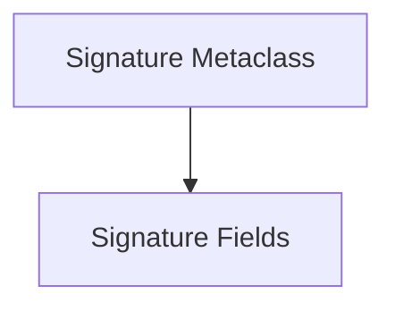

# DSPy Signatures Module

The `dspy_signatures` module is a core component of the DSPy framework, responsible for defining and managing the structure of prompt signatures. Signatures are declarative interfaces that specify the input and output fields for language model calls, enabling DSPy to automatically construct prompts, handle parsing, and enforce type constraints. This module provides the foundational elements for defining these powerful contractual agreements with LMs.

## Architecture Overview

The `dspy_signatures` module primarily consists of two key areas: the definition of signature fields and the metaclass that orchestrates the creation and validation of `Signature` objects. The `SignatureMeta` class leverages the field definitions to build robust and type-safe LM interfaces.

<!-- DIAGRAM_JSON
{
    "direction": "TD",
    "nodes": [
        {"id": "signature_meta_class", "label": "Signature Metaclass", "type": "module", "link": "signature_meta_class.md"},
        {"id": "signature_fields", "label": "Signature Fields", "type": "module", "link": "signature_fields.md"}
    ],
    "edges": [
        {"source": "signature_meta_class", "target": "signature_fields"}
    ],
    "groups": []
}
-->

## Sub-modules

### [Signature Metaclass](signature_meta_class.md)
The `signature_meta_class` sub-module defines the `SignatureMeta` metaclass, which is instrumental in the creation, validation, and introspection of DSPy `Signature` objects. It handles the dynamic construction of signatures, including field ordering, type inference, and the automatic generation of instructions for the language model based on the signature's docstring.

### [Signature Fields](signature_fields.md)
The `signature_fields` sub-module is responsible for defining the individual input and output fields that comprise a DSPy signature. It provides utilities for converting between different field representations and defines the base classes for input and output fields, ensuring that each field carries necessary metadata like prefixes, descriptions, and format specifications.
