## `dspy_teleprompting_optimizers` Module Overview

### Purpose
The `dspy_teleprompting_optimizers` module provides a comprehensive suite of teleprompting strategies and optimizers for DSPy programs. It enables automated generation, refinement, and selection of prompts (instructions and few-shot examples) to enhance the performance, robustness, and efficiency of language model-based applications. This module is central to automating the "compilation" process in DSPy, allowing programs to self-improve through various optimization techniques.

### Architecture
The `dspy_teleprompting_optimizers` module is composed of several specialized sub-modules, each implementing a distinct teleprompting or optimization strategy. These sub-modules work together to provide a rich toolkit for program improvement.

```mermaid
graph TD
    teleprompt_main[dspy_teleprompting_optimizers]

    avatar_optimizer[Avatar Optimizer]
    better_together[BetterTogether]
    bootstrap_trace[Bootstrap Trace]
    copro_optimizer[CoPro Optimizer]
    gepa_optimizer[GEPA Optimizer]
    grpo_optimizer[GRPO Optimizer]
    infer_rules[Infer Rules]
    knn_fewshot[KNNFewShot]
    mipro_optimizer_v2[MIPROv2 Optimizer]
    simba_optimizer[SIMBA Optimizer]
    teleprompt_optuna[BootstrapFewShotWithOptuna]
    teleprompt_utils[Teleprompt Utilities]

    teleprompt_main --> avatar_optimizer
    teleprompt_main --> better_together
    teleprompt_main --> bootstrap_trace
    teleprompt_main --> copro_optimizer
    teleprompt_main --> gepa_optimizer
    teleprompt_main --> grpo_optimizer
    teleprompt_main --> infer_rules
    teleprompt_main --> knn_fewshot
    teleprompt_main --> mipro_optimizer_v2
    teleprompt_main --> simba_optimizer
    teleprompt_main --> teleprompt_optuna
    teleprompt_main --> teleprompt_utils

    click avatar_optimizer "avatar_optimizer.md" "View Avatar Optimizer Documentation"
    click better_together "better_together.md" "View BetterTogether Documentation"
    click bootstrap_trace "bootstrap_trace.md" "View Bootstrap Trace Documentation"
    click copro_optimizer "copro_optimizer.md" "View CoPro Optimizer Documentation"
    click gepa_optimizer "gepa_optimizer.md" "View GEPA Optimizer Documentation"
    click grpo_optimizer "grpo_optimizer.md" "View GRPO Optimizer Documentation"
    click infer_rules "infer_rules.md" "View Infer Rules Documentation"
    click knn_fewshot "knn_fewshot.md" "View KNNFewShot Documentation"
    click mipro_optimizer_v2 "mipro_optimizer_v2.md" "View MIPROv2 Optimizer Documentation"
    click simba_optimizer "simba_optimizer.md" "View SIMBA Optimizer Documentation"
    click teleprompt_optuna "teleprompt_optuna.md" "View BootstrapFewShotWithOptuna Documentation"
    click teleprompt_utils "teleprompt_utils.md" "View Teleprompt Utilities Documentation"
```

### Core Components Documentation

The `dspy_teleprompting_optimizers` module is comprised of the following key sub-modules and components:

*   **[Avatar Optimizer](avatar_optimizer.md)**: The `avatar_optimizer` module is a core component within the `dspy.teleprompt` library, designed to iteratively refine and optimize the performance of an `Avatar` agent. It achieves this by evaluating the avatar's output against a given metric, identifying successful and unsuccessful examples, and then generating feedback to improve the avatar's instructions.
*   **[`better_together`](better_together.md)**: The `better_together` module introduces `BetterTogether`, a meta-optimizer for DSPy programs. It is designed to combine prompt optimization and weight optimization (fine-tuning) in configurable sequences.
*   **[`bootstrap_trace`](bootstrap_trace.md)**: The `bootstrap_trace` module is a vital component within the `dspy.teleprompt` ecosystem, specifically designed to enhance the robustness of program execution during teleprompting by intercepting and handling parsing errors.
*   **[CoPro Optimizer](copro_optimizer.md)**: The `copro_optimizer` module in DSPy implements the COPRO (Code-Optimized Prompting) teleprompter, a method for automatically optimizing prompts for large language models. This module focuses on iteratively refining the instructions and output field prefixes of DSPy programs to improve their performance on a given task.
*   **[GEPA Optimizer](gepa_optimizer.md)**: The `gepa_optimizer` module implements the GEPA (Genetic Evolution for Prompt Adaptation) teleprompter, an evolutionary optimizer designed to refine the text components of complex systems. It focuses specifically on prompt evolution for DSPy modules, leveraging reflection to guide the optimization process and incorporating textual feedback for continuous improvement.
*   **[`grpo_optimizer`](grpo_optimizer.md)**: The `grpo_optimizer` module provides the Guided Reinforcement Prompt Optimization (GRPO) teleprompter, a powerful tool for fine-tuning Language Models (LMs) within DSPy programs. GRPO optimizes the student program's LMs by leveraging feedback from teacher programs and a specified metric, aiming to improve the program's overall performance.
*   **[Infer Rules](infer_rules.md)**: The `infer_rules` module is a crucial component within the DSPy teleprompting strategies, designed to automatically induce and apply natural language rules to enhance the performance of DSPy programs. By analyzing few-shot examples, this module identifies patterns and distills them into actionable rules, which are then integrated into the program's instruction set.
*   **[`knn_fewshot`](knn_fewshot.md)**: The `knn_fewshot` module provides a powerful teleprompting strategy, `KNNFewShot`, designed to enhance the performance of DSPy programs by dynamically selecting relevant few-shot examples at inference time. This approach leverages K-Nearest Neighbors (KNN) to identify the most similar training examples to a given input, which are then used as demonstrations for the student module.
*   **[`mipro_optimizer_v2`](mipro_optimizer_v2.md)**: The `mipro_optimizer_v2` module introduces `MIPROv2`, a sophisticated teleprompter designed for optimizing DSPy programs. It leverages Bayesian Optimization to systematically search for the best combination of instructions and few-shot demonstrations, thereby enhancing program performance.
*   **[`simba_optimizer`](simba_optimizer.md)**: The `simba_optimizer` module implements the SIMBA teleprompter, a strategy for optimizing DSPy programs by iteratively refining prompts and demonstrations.
*   **[`teleprompt_optuna`](teleprompt_optuna.md)**: The `teleprompt_optuna` module provides `BootstrapFewShotWithOptuna`, an optimizer that leverages the Optuna library for hyperparameter tuning during the few-shot bootstrapping process.
*   **[Teleprompt Utilities](teleprompt_utils.md)**: The `teleprompt_utils` module provides a collection of utility functions designed to support various teleprompting strategies within the DSPy framework. These utilities assist in evaluating program quality, logging critical metrics like token usage, and analyzing the execution history of candidate programs.