# dspy_utilities Module Documentation

## Introduction

The `dspy_utilities` module provides a collection of essential utility functions and classes that support various functionalities across the dspy framework. These utilities range from asynchronous programming helpers and callback mechanisms to file downloading, annotation tools, and dummy implementations for testing. This module aims to offer reusable components that simplify common tasks and enhance the overall robustness and flexibility of the dspy system.

## Architecture Overview

The `dspy_utilities` module is composed of several independent sub-modules, each encapsulating a specific set of functionalities. These sub-modules are designed to be loosely coupled, allowing for modular development and easier maintenance. The core `dspy_utilities` module acts as a central point, integrating and exposing these specialized utilities.

<!-- DIAGRAM_JSON
{
    "direction": "TD",
    "nodes": [
        {"id": "dspy_utilities", "label": "DSPy Utilities", "type": "module"},
        {"id": "annotation_utilities", "label": "Annotation Utilities", "type": "module", "link": "annotation_utilities.md"},
        {"id": "asynchronization_utilities", "label": "Asynchronization Utilities", "type": "module", "link": "asynchronization_utilities.md"},
        {"id": "callback_wrappers", "label": "Callback Wrappers", "type": "module", "link": "callback_wrappers.md"},
        {"id": "download_utility", "label": "Download Utility", "type": "module", "link": "download_utility.md"},
        {"id": "dummy_components", "label": "Dummy Components", "type": "module", "link": "dummy_components.md"},
        {"id": "synchronization_wrapper", "label": "Synchronization Wrapper", "type": "module", "link": "synchronization_wrapper.md"}
    ],
    "edges": [
        {"source": "dspy_utilities", "target": "annotation_utilities"},
        {"source": "dspy_utilities", "target": "asynchronization_utilities"},
        {"source": "dspy_utilities", "target": "callback_wrappers"},
        {"source": "dspy_utilities", "target": "download_utility"},
        {"source": "dspy_utilities", "target": "dummy_components"},
        {"source": "dspy_utilities", "target": "synchronization_wrapper"}
    ],
    "groups": []
}
-->

```mermaid
graph TD
    dspy_utilities[DSPy Utilities]
    annotation_utilities[Annotation Utilities]
    asynchronization_utilities[Asynchronization Utilities]
    callback_wrappers[Callback Wrappers]
    download_utility[Download Utility]
    dummy_components[Dummy Components]
    synchronization_wrapper[Synchronization Wrapper]

    dspy_utilities --> annotation_utilities
    dspy_utilities --> asynchronization_utilities
    dspy_utilities --> callback_wrappers
    dspy_utilities --> download_utility
    dspy_utilities --> dummy_components
    dspy_utilities --> synchronization_wrapper

    click annotation_utilities "annotation_utilities.md" "View Annotation Utilities Documentation"
    click asynchronization_utilities "asynchronization_utilities.md" "View Asynchronization Utilities Documentation"
    click callback_wrappers "callback_wrappers.md" "View Callback Wrappers Documentation"
    click download_utility "download_utility.md" "View Download Utility Documentation"
    click dummy_components "dummy_components.md" "View Dummy Components Documentation"
    click synchronization_wrapper "synchronization_wrapper.md" "View Synchronization Wrapper Documentation"
```

## High-Level Functionality

The `dspy_utilities` module comprises the following sub-modules, each contributing to the overall utility of the dspy framework:

*   **[Annotation Utilities](annotation_utilities.md)**: Provides decorators for annotating functions, such as marking them as experimental with a specified version.
*   **[Asynchronization Utilities](asynchronization_utilities.md)**: Facilitates asynchronous execution of programs, managing concurrency with a capacity limiter and preserving thread-local overrides.
*   **[Callback Wrappers](callback_wrappers.md)**: Implements synchronous and asynchronous wrappers to execute callbacks before and after function calls, managing call IDs and exceptions.
*   **[Download Utility](download_utility.md)**: Offers a utility function for downloading files, checking for existing files and their sizes before initiating a download.
*   **[Dummy Components](dummy_components.md)**: Contains dummy implementations, such as a Dummy Language Model and an inner retrieval function, primarily for testing purposes.
*   **[Synchronization Wrapper](synchronization_wrapper.md)**: Provides a mechanism to wrap asynchronous programs into a synchronous interface, allowing them to be called synchronously.
