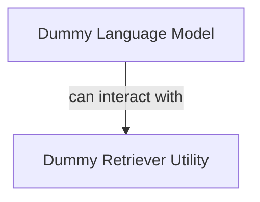

# Dummy Components Module

## Introduction

The `dummy_components` module provides mock implementations of various DSPy components, such as language models and retrievers. These dummy components are primarily used for unit testing, development, and debugging purposes, allowing developers to test their DSPy programs without relying on actual external services or complex retrieval mechanisms.

## Architecture

The `dummy_components` module is structured into sub-modules, each encapsulating specific dummy functionalities. The architecture diagram below illustrates the relationship between these components:

<!-- DIAGRAM_JSON
{
    "direction": "TD",
    "nodes": [
        {"id": "dummy_language_model", "label": "Dummy Language Model", "type": "module", "link": "dummy_language_model.md"},
        {"id": "dummy_retriever_utility", "label": "Dummy Retriever Utility", "type": "module", "link": "dummy_retriever_utility.md"}
    ],
    "edges": [
        {"source": "dummy_language_model", "target": "dummy_retriever_utility", "label": "can interact with"}
    ],
    "groups": []
}
-->

## Sub-modules

Here are the key sub-modules within `dummy_components`:

*   **[Dummy Language Model](dummy_language_model.md)**: Provides a configurable mock language model for testing different scenarios.
*   **[Dummy Retriever Utility](dummy_retriever_utility.md)**: Offers a simulated retrieval mechanism for testing components dependent on retrievers.