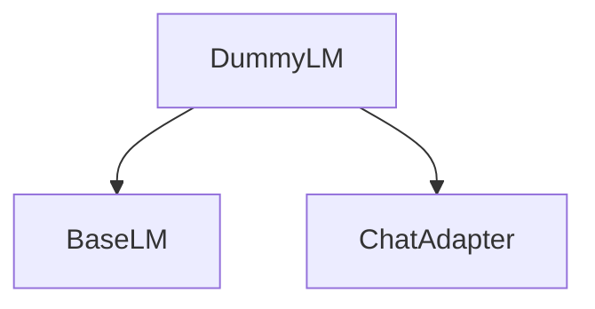

# `dummy_language_model` Module Documentation

## Introduction

The `dummy_language_model` module provides the `DummyLM` class, a versatile mock language model designed specifically for unit testing and development purposes within the DSPy framework. It allows developers to simulate language model responses in a controlled and predictable manner, facilitating robust testing of DSPy programs without relying on actual LLM API calls.

## Architecture and Component Relationships

The `dummy_language_model` module's core component is the `DummyLM` class. This class inherits from `BaseLM`, a foundational component in the DSPy client ecosystem, and utilizes an `Adapter` (typically `ChatAdapter`) to format its output consistently with how real language models interact within DSPy.

<!-- DIAGRAM_JSON
{
    "direction": "TD",
    "nodes": [
        {"id": "DummyLM", "label": "DummyLM", "type": "component", "link": null},
        {"id": "BaseLM", "label": "BaseLM", "type": "external", "link": "dspy_clients.md"},
        {"id": "ChatAdapter", "label": "ChatAdapter", "type": "external", "link": "dspy_adapters.md"}
    ],
    "edges": [
        {"source": "DummyLM", "target": "BaseLM"},
        {"source": "DummyLM", "target": "ChatAdapter"}
    ],
    "groups": []
}
-->


## Core Functionality: `DummyLM` Class

`dspy.utils.dummies.DummyLM` is the central class of this module, designed to mimic the behavior of a language model under various controlled conditions.

### Initialization

```python
class DummyLM(BaseLM):
    def __init__(
        self,
        answers: list[dict[str, Any]] | dict[str, dict[str, Any]],
        follow_examples: bool = False,
        reasoning: bool = False,
        adapter=None,
    ):
        # ... (constructor details)
```

- `answers`: This parameter determines the behavior of the `DummyLM`. It can be:
    - A `list[dict[str, Any]]`: Responses are returned sequentially.
    - A `dict[str, dict[str, Any]]`: Responses are matched based on keywords in the prompt's final message.
- `follow_examples`: If `True`, the `DummyLM` will attempt to find an exact match for the prompt within provided `dspy.Example` objects and return the corresponding output.
- `reasoning`: If `True`, a dummy reasoning content ("Some reasoning") is added to the message.
- `adapter`: An optional adapter for formatting the output. Defaults to `ChatAdapter`.

### Modes of Operation

The `DummyLM` supports three primary modes for generating responses:

1.  **List of Dictionaries (Sequential)**:
    When initialized with a list of dictionaries, `DummyLM` iterates through this list, returning the next dictionary's content for each `forward` call. The dictionary content is formatted into a field-value string by the internal adapter.

    ```python
    lm = DummyLM([{"answer": "red"}, {"answer": "blue"}])
    # First call returns "red"
    # Second call returns "blue"
    ```

2.  **Dictionary of Dictionaries (Keyword Matching)**:
    If initialized with a dictionary where keys are expected prompt parts and values are response dictionaries, `DummyLM` searches for a key that matches a substring in the final message of the prompt. If a match is found, the corresponding response dictionary is formatted and returned.

    ```python
    lm = DummyLM({"What color is the sky?": {"answer": "blue"}})
    # If prompt contains "What color is the sky?", returns "blue"
    ```

3.  **Follow Examples (Exact Prompt Matching)**:
    When `follow_examples` is set to `True`, the `DummyLM` attempts to find an exact match for the input prompt within the `demos` (examples) provided to a DSPy `Predictor`. If an exact `input` match is found in an example, its `output` is returned.

    ```python
    lm = DummyLM([{"answer": "red"}], follow_examples=True)
    # If a demo with input "What color is the sky?" and output "blue" is provided,
    # and the prompt is exactly "What color is the sky?", then "blue" is returned.
    ```

### Key Methods

-   `_use_example(messages)`:
    An internal helper method to extract the output from an example within a list of messages, primarily used when `follow_examples` is enabled.

-   `_format_answer_fields(field_names_and_values: dict[str, Any])`:
    Formats the given dictionary of field names and values into a string representation using the configured `adapter`. This ensures that the dummy responses mimic the structure of actual LLM outputs.

-   `forward(self, prompt=None, messages=None, **kwargs)`:
    The main method for generating a response. It processes the input `prompt` or `messages` and, based on the `DummyLM`'s configuration (`answers`, `follow_examples`), determines and formats the appropriate dummy response.

-   `aforward(self, prompt=None, messages=None, **kwargs)`:
    An asynchronous version of the `forward` method, simply calling `forward` for compatibility with async contexts.

-   `get_convo(self, index)`:
    Retrieves the prompt and answer from the `history` at a given `index`. This is useful for inspecting the interactions with the `DummyLM`.

## How It Fits into the Overall System

The `dummy_language_model` module, particularly the `DummyLM` class, is a crucial utility within the DSPy framework for enabling reliable and efficient testing. It integrates with the broader DSPy ecosystem by:

-   **Implementing `BaseLM`**: It adheres to the `BaseLM` interface (defined in [dspy_clients.md](dspy_clients.md)), allowing it to be configured as the primary language model for any DSPy program using `dspy.configure(lm=lm_instance)`.
-   **Using Adapters**: Its reliance on adapters (e.g., [dspy_adapters.md](dspy_adapters.md)) ensures that its output format is consistent with how real LLMs are integrated, making the transition from dummy models to real ones seamless.
-   **Facilitating Module Testing**: By providing predictable responses, `DummyLM` is invaluable for testing individual DSPy modules, prediction strategies, and optimizers without incurring costs or latency associated with actual LLM API calls. This is especially useful for unit tests and integration tests where deterministic behavior is paramount.

In essence, `dummy_language_model` provides a testing harness that allows DSPy developers to build and verify their programs with confidence, ensuring correctness before deployment with live language models.