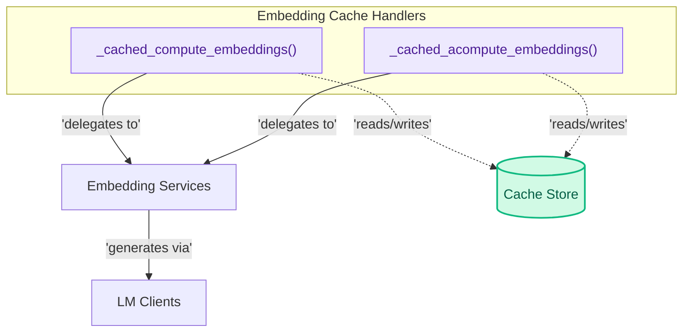

# Embedding Caching Module
This module provides cached wrappers for synchronous and asynchronous embedding computation functions, optimizing performance by storing and retrieving embeddings to reduce redundant calls to language models.

<!-- DIAGRAM_JSON
{
    "direction": "TD",
    "nodes": [
        {"id": "sync_cache", "label": "_cached_compute_embeddings()", "type": "component", "link": null},
        {"id": "async_cache", "label": "_cached_acompute_embeddings()", "type": "component", "link": null},
        {"id": "embed_services", "label": "Embedding Services", "type": "external", "link": "embedding_services.md"},
        {"id": "lm_clients_mod", "label": "LM Clients", "type": "external", "link": "lm_clients.md"},
        {"id": "cache_store", "label": "Cache Store", "type": "data", "link": null}
    ],
    "edges": [
        {"source": "sync_cache", "target": "embed_services", "label": "delegates to"},
        {"source": "async_cache", "target": "embed_services", "label": "delegates to"},
        {"source": "sync_cache", "target": "cache_store", "label": "reads/writes"},
        {"source": "async_cache", "target": "cache_store", "label": "reads/writes"},
        {"source": "embed_services", "target": "lm_clients_mod", "label": "generates via"}
    ],
    "groups": [
        {"id": "cache_handlers", "label": "Embedding Cache Handlers", "role": "analytical", "nodes": ["sync_cache", "async_cache"]}
    ]
}
-->

