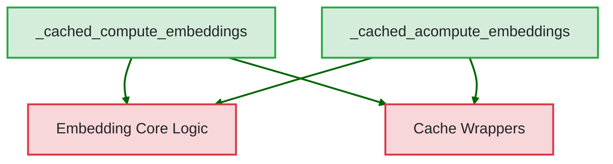

# `embedding_caching_functions`

## Introduction

The `embedding_caching_functions` module provides a cached interface for computing embeddings, both synchronously and asynchronously. Its primary goal is to enhance performance by leveraging a caching mechanism for embedding generation, avoiding redundant computations for identical inputs.

## Purpose and Core Functionality

This module wraps the core embedding computation logic with a caching layer. It exposes two key functions that allow other parts of the system to obtain embeddings efficiently:

*   `_cached_compute_embeddings`: A synchronous function that computes embeddings for a batch of inputs. It checks the cache first and, if the embeddings are not found, computes them using the underlying embedding model and then stores them in the cache before returning.
*   `_cached_acompute_embeddings`: An asynchronous counterpart to `_cached_compute_embeddings`. It performs the same caching logic but in a non-blocking manner, suitable for async environments.

By providing these cached interfaces, the module significantly reduces the latency and computational cost associated with frequently requested embeddings.

## Architecture and Component Relationships

The `embedding_caching_functions` module acts as a caching facade over the fundamental embedding computation functions. It directly utilizes the core `_compute_embeddings` and `_acompute_embeddings` functions (located in the broader `dspy.clients.embedding` context) and integrates with the caching infrastructure managed by `dspy.clients.cache`.

### Components

*   **`_cached_compute_embeddings`**: (dspy.clients.embedding._cached_compute_embeddings) The synchronous entry point for cached embedding computation. It delegates to the core embedding logic if a cache miss occurs and utilizes the caching mechanism.
*   **`_cached_acompute_embeddings`**: (dspy.clients.embedding._cached_acompute_embeddings) The asynchronous entry point for cached embedding computation. Similar to its synchronous counterpart, it handles cache lookups, delegates to the core async embedding logic, and stores results in the cache.

### Dependencies

*   **Embedding Core Logic**: This module depends on the actual (non-cached) `_compute_embeddings` and `_acompute_embeddings` functions provided by the `embedding_cache` module (parent module of `embedding_caching_functions`), which perform the heavy lifting of interacting with an embedding model.
*   **[Cache Wrappers](cache_wrappers.md)**: The caching functionality itself relies on the `cache_wrappers` module, specifically `dspy.clients.cache.sync_wrapper` and `dspy.clients.cache.async_wrapper`, to manage the storage and retrieval of cached embeddings.

## How the Module Fits into the Overall System

The `embedding_caching_functions` module is a crucial part of the `dspy_clients` package, specifically within the `embedding_cache` sub-system. It serves as a performance optimization layer for all operations that require embeddings. By transparently adding caching to embedding calls, it ensures that repeated requests for the same text inputs do not incur the full cost of calling an external embedding model, leading to faster execution and reduced API costs across the entire DSPy framework. It acts as an intermediary, enhancing the efficiency of the core embedding provider interactions.

<!-- DIAGRAM_JSON
{
    "direction": "TD",
    "nodes": [
        {"id": "A", "label": "_cached_compute_embeddings", "type": "component", "link": null},
        {"id": "B", "label": "_cached_acompute_embeddings", "type": "component", "link": null},
        {"id": "C", "label": "Embedding Core Logic", "type": "external", "link": "embedding_cache.md"},
        {"id": "D", "label": "Cache Wrappers", "type": "external", "link": "cache_wrappers.md"}
    ],
    "edges": [
        {"source": "A", "target": "C"},
        {"source": "A", "target": "D"},
        {"source": "B", "target": "C"},
        {"source": "B", "target": "D"}
    ],
    "groups": []
}
-->
