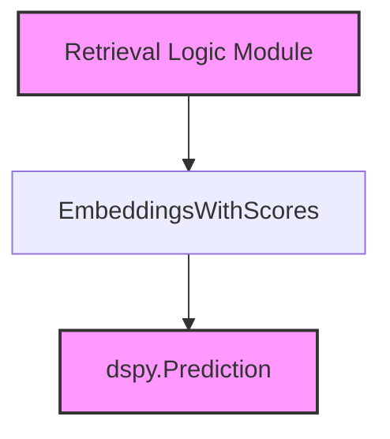

# `embedding_retrieval` Module Documentation

This module provides enhanced embedding-based retrieval capabilities, specifically through the `EmbeddingsWithScores` class. It extends basic embedding retrieval to include similarity scores, which are crucial for advanced downstream tasks like re-ranking and thresholding.

## Core Functionality

### `EmbeddingsWithScores`

-   **Purpose:** A DSPy retriever class that performs embedding-based search and returns not only the retrieved passages and their indices but also their similarity scores relative to the query.
-   **Inheritance:** Inherits from `Embeddings` (assumed to be a base class in the `dspy.retrievers.embeddings` module).
-   **Key Method:**
    -   `forward(query: str)`: Executes the search operation. It takes a query string, uses an internal `search_fn` (expected to be set during initialization) to retrieve passages, indices, and scores, and then packages these results into a `dspy.Prediction` object.

## Architecture and Component Relationships

<!-- DIAGRAM_JSON
{
    "direction": "TD",
    "nodes": [
        {"id": "embeddings_with_scores", "label": "EmbeddingsWithScores", "type": "component", "link": null},
        {"id": "dspy_prediction_type", "label": "dspy.Prediction", "type": "external", "link": "dspy_primitives.md"},
        {"id": "retrieval_logic", "label": "Retrieval Logic Module", "type": "external", "link": "retrieval_logic.md"}
    ],
    "edges": [
        {"source": "embeddings_with_scores", "target": "dspy_prediction_type"},
        {"source": "retrieval_logic", "target": "embeddings_with_scores"}
    ],
    "groups": []
}
-->

## How it fits into the overall system

The `embedding_retrieval` module, specifically `EmbeddingsWithScores`, is a fundamental component within the `dspy_retrievers` ecosystem. It provides a specialized retrieval mechanism that enriches the standard embedding-based search with similarity scores. This functionality is crucial for downstream modules, particularly those involved in [retrieval_logic](retrieval_logic.md), which might utilize these scores for filtering, re-ranking, or more sophisticated decision-making processes in information retrieval tasks. By returning scores, `EmbeddingsWithScores` enables a more granular and intelligent approach to passage selection and ranking within DSPy programs. It acts as a specialized data provider for retrieval pipelines, enhancing the quality and relevance of retrieved information.
