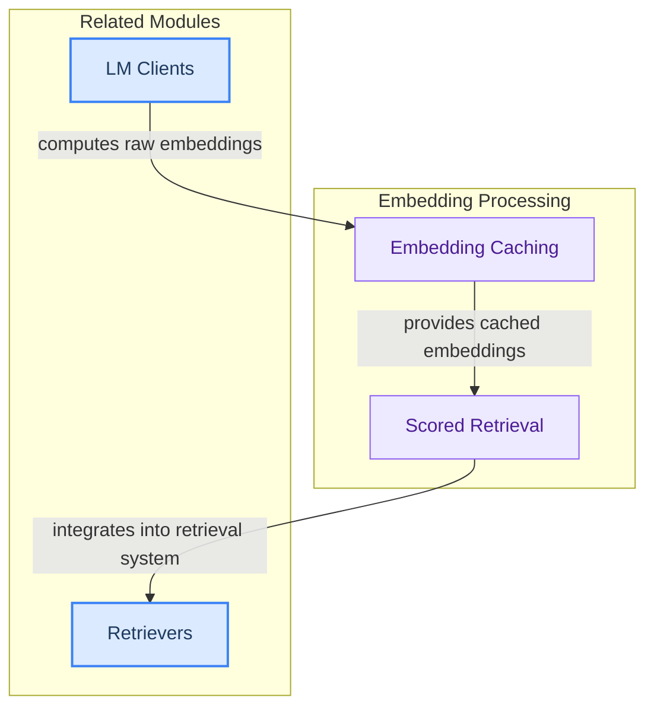

# Embedding Services
This module handles the efficient computation and retrieval of embeddings, featuring cached embedding operations and a specialized retriever that provides passages with similarity scores.
<!-- DIAGRAM_JSON
{
    "direction": "TD",
    "nodes": [
        {
            "id": "embedding_services",
            "label": "Embedding Services",
            "type": "module"
        },
        {
            "id": "embedding_caching",
            "label": "Embedding Caching",
            "type": "module",
            "link": "embedding_caching.md"
        },
        {
            "id": "scored_retrieval",
            "label": "Scored Retrieval",
            "type": "module",
            "link": "scored_retrieval.md"
        },
        {
            "id": "lm_clients_module",
            "label": "LM Clients",
            "type": "external",
            "link": "lm_clients.md"
        },
        {
            "id": "retrievers_module",
            "label": "Retrievers",
            "type": "external",
            "link": "retrievers.md"
        }
    ],
    "edges": [
        {
            "source": "lm_clients_module",
            "target": "embedding_caching",
            "label": "computes raw embeddings"
        },
        {
            "source": "embedding_caching",
            "target": "scored_retrieval",
            "label": "provides cached embeddings"
        },
        {
            "source": "scored_retrieval",
            "target": "retrievers_module",
            "label": "integrates into retrieval system"
        }
    ],
    "groups": [
        {
            "id": "embedding_processing",
            "label": "Embedding Processing",
            "role": "analytical",
            "nodes": [
                "embedding_caching",
                "scored_retrieval"
            ]
        },
        {
            "id": "related_modules",
            "label": "Related Modules",
            "role": "surface",
            "nodes": [
                "lm_clients_module",
                "retrievers_module"
            ]
        }
    ]
}
-->
