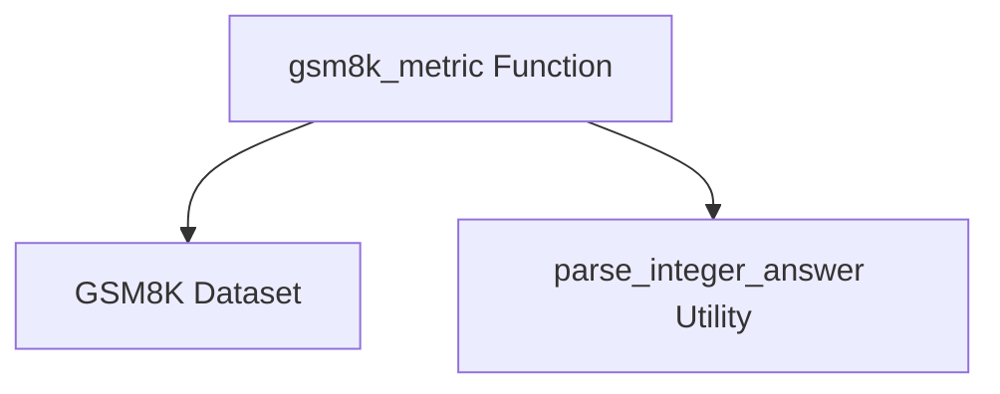

# evaluation_metric Module Documentation

## Introduction
The `evaluation_metric` module provides specific metrics for evaluating the performance of models, particularly within the context of datasets like GSM8K where numerical answer correctness is crucial.

## Core Functionality
The primary function of this module is to offer a precise method for comparing predicted numerical answers against ground truth answers.

## Architecture and Component Relationships

### `gsm8k_metric`
The `gsm8k_metric` function is designed to assess the correctness of answers for the GSM8K dataset. It takes a gold standard answer and a predicted answer, parses them as integers, and returns `True` if they match, `False` otherwise. This ensures a strict numerical comparison for evaluating arithmetic reasoning tasks.

### Dependencies
This module is tightly coupled with the [gsm8k_dataset](gsm8k_dataset.md) module, as its `gsm8k_metric` function is specifically tailored for evaluating tasks from the GSM8K dataset. It also relies on a utility function, `parse_integer_answer`, for safely converting string representations of answers into integers for comparison.

<!-- DIAGRAM_JSON
{
    "direction": "TD",
    "nodes": [
        {"id": "gsm8k_metric", "label": "gsm8k_metric Function", "type": "component", "link": null},
        {"id": "gsm8k_dataset", "label": "GSM8K Dataset", "type": "external", "link": "gsm8k_dataset.md"},
        {"id": "parse_integer_answer", "label": "parse_integer_answer Utility", "type": "external", "link": null}
    ],
    "edges": [
        {"source": "gsm8k_metric", "target": "gsm8k_dataset"},
        {"source": "gsm8k_metric", "target": "parse_integer_answer"}
    ],
    "groups": []
}
-->

