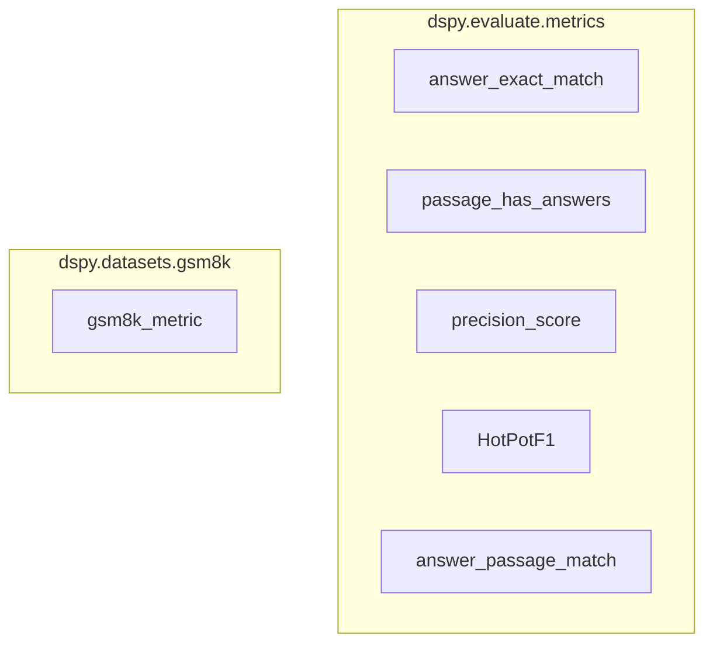

# evaluation_metrics
This module provides a collection of evaluation metrics for assessing the quality of language model predictions, including exact match, F1 scores, and passage-based answer verification.

<!-- DIAGRAM_JSON
{
    "nodes": [
        {
            "id": "evaluation_metrics",
            "label": "evaluation_metrics",
            "type": "module"
        },
        {
            "id": "answer_exact_match",
            "label": "answer_exact_match"
        },
        {
            "id": "passage_has_answers",
            "label": "passage_has_answers"
        },
        {
            "id": "precision_score",
            "label": "precision_score"
        },
        {
            "id": "HotPotF1",
            "label": "HotPotF1"
        },
        {
            "id": "answer_passage_match",
            "label": "answer_passage_match"
        },
        {
            "id": "gsm8k_metric",
            "label": "gsm8k_metric"
        },
        {
            "id": "passage_based_evaluation",
            "label": "Passage-Based Evaluation",
            "type": "module",
            "link": "passage_based_evaluation.md"
        },
        {
            "id": "direct_answer_comparison",
            "label": "Direct Answer Comparison",
            "type": "module",
            "link": "direct_answer_comparison.md"
        },
        {
            "id": "text_similarity_f1",
            "label": "Text Similarity and F1 Scores",
            "type": "module",
            "link": "text_similarity_f1.md"
        }
    ],
    "edges": [
        {
            "source": "evaluation_metrics",
            "target": "passage_based_evaluation"
        },
        {
            "source": "evaluation_metrics",
            "target": "direct_answer_comparison"
        },
        {
            "source": "evaluation_metrics",
            "target": "text_similarity_f1"
        }
    ],
    "groups": [
        {
            "id": "dspy_evaluate_metrics",
            "label": "dspy.evaluate.metrics",
            "nodes": [
                "answer_exact_match",
                "passage_has_answers",
                "precision_score",
                "HotPotF1",
                "answer_passage_match"
            ]
        },
        {
            "id": "dspy_datasets_gsm8k",
            "label": "dspy.datasets.gsm8k",
            "nodes": [
                "gsm8k_metric"
            ]
        }
    ]
}
-->
