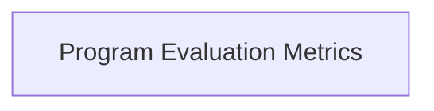

# Evaluation Utilities Module

## Introduction

The `evaluation_utilities` module provides a set of essential functions for evaluating the performance and quality of proposed programs and language models within the DSPy framework. It offers tools to inspect the history of task models and calculate program quality over time, aiding in the analysis and improvement of teleprompting strategies.

## Architecture

The `evaluation_utilities` module is composed of the `program_evaluation_metrics` sub-module, which encapsulates core functionalities related to program assessment.

<!-- DIAGRAM_JSON
{
    "direction": "TD",
    "nodes": [
        {"id": "program_evaluation_metrics", "label": "Program Evaluation Metrics", "type": "module", "link": "program_evaluation_metrics.md"}
    ],
    "edges": [],
    "groups": []
}
-->

## Sub-modules

### [Program Evaluation Metrics](program_evaluation_metrics.md)

This sub-module contains functions for detailed program assessment, including tracing the history of task models and calculating the quality of proposed programs over a specified number of trials. It is crucial for understanding how programs evolve and perform during optimization.
