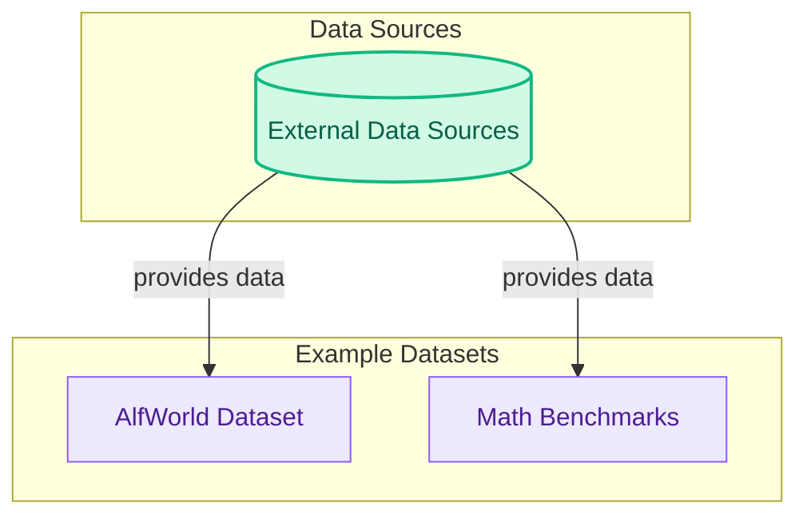

# Example Datasets
This module provides access to a collection of common datasets, including interactive environments like AlfWorld and mathematical reasoning benchmarks such as GSM8K and MATH, facilitating diverse program evaluation.

<!-- DIAGRAM_JSON
{
    "direction": "TD",
    "nodes": [
        {"id": "alfworld_dataset", "label": "AlfWorld Dataset", "type": "module", "link": "alfworld_dataset.md"},
        {"id": "math_datasets", "label": "Math Benchmarks", "type": "module", "link": "math_datasets.md"},
        {"id": "external_data_source", "label": "External Data Sources", "type": "external"}
    ],
    "edges": [
        {"source": "external_data_source", "target": "alfworld_dataset", "label": "provides data"},
        {"source": "external_data_source", "target": "math_datasets", "label": "provides data"}
    ],
    "groups": [
        {"id": "data_sources", "label": "Data Sources", "role": "data", "nodes": ["external_data_source"]},
        {"id": "example_datasets_group", "label": "Example Datasets", "role": "analytical", "nodes": ["alfworld_dataset", "math_datasets"]}
    ]
}
-->
