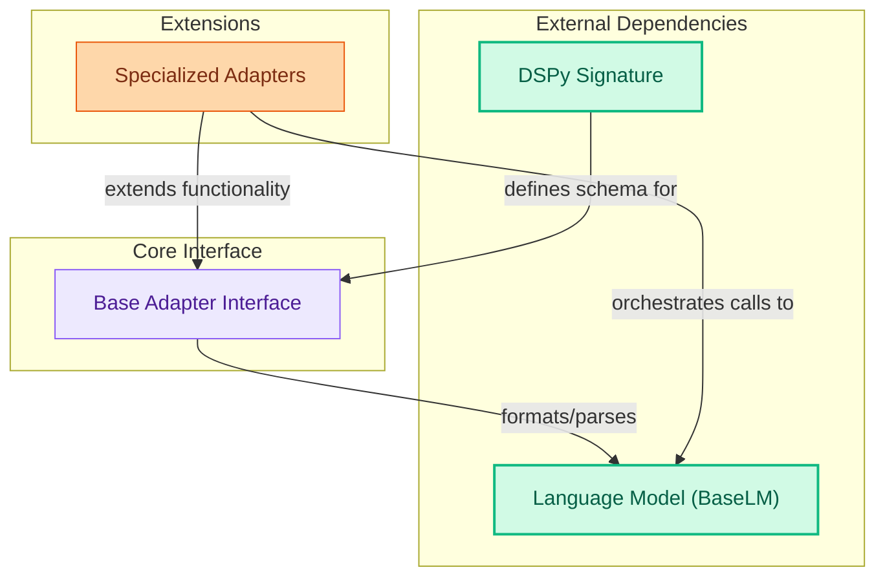

# External Adapters

This module provides interfaces that bridge DSPy programs with various Language Models. It defines a base adapter for formatting inputs, parsing outputs, and handling native LM features, along with specialized adapters for enhanced functionality.

<!-- DIAGRAM_JSON
{
    "direction": "TD",
    "nodes": [
        {"id": "base_adapter", "label": "Base Adapter Interface", "type": "module", "link": "base_adapter.md"},
        {"id": "specialized_adapters", "label": "Specialized Adapters", "type": "module", "link": "specialized_adapters.md"},
        {"id": "lang_model", "label": "Language Model (BaseLM)", "type": "external"},
        {"id": "dspy_signature", "label": "DSPy Signature", "type": "external"}
    ],
    "edges": [
        {"source": "dspy_signature", "target": "base_adapter", "label": "defines schema for"},
        {"source": "base_adapter", "target": "lang_model", "label": "formats/parses"},
        {"source": "specialized_adapters", "target": "base_adapter", "label": "extends functionality"},
        {"source": "specialized_adapters", "target": "lang_model", "label": "orchestrates calls to"}
    ],
    "groups": [
        {"id": "core_interface", "label": "Core Interface", "role": "analytical", "nodes": ["base_adapter"]},
        {"id": "extensions", "label": "Extensions", "role": "generative", "nodes": ["specialized_adapters"]},
        {"id": "dependencies", "label": "External Dependencies", "role": "data", "nodes": ["lang_model", "dspy_signature"]}
    ]
}
-->
