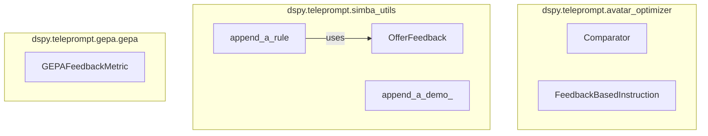

# feedback_and_rules
This module provides DSPy signatures for generating and incorporating feedback, a protocol for defining feedback metrics, and utility functions for dynamically appending rules and demonstrations to improve LLM program performance.

<!-- DIAGRAM_JSON
{
    "nodes": [
        {
            "id": "feedback_and_rules",
            "label": "feedback_and_rules",
            "type": "module"
        },
        {
            "id": "Comparator",
            "label": "Comparator"
        },
        {
            "id": "FeedbackBasedInstruction",
            "label": "FeedbackBasedInstruction"
        },
        {
            "id": "GEPAFeedbackMetric",
            "label": "GEPAFeedbackMetric"
        },
        {
            "id": "append_a_rule",
            "label": "append_a_rule"
        },
        {
            "id": "append_a_demo_",
            "label": "append_a_demo_"
        },
        {
            "id": "OfferFeedback",
            "label": "OfferFeedback"
        },
        {
            "id": "instruction_and_rule_generation",
            "label": "Generate Instructions & Rules",
            "type": "module",
            "link": "instruction_and_rule_generation.md"
        },
        {
            "id": "feedback_application_utilities",
            "label": "Apply Feedback Utilities",
            "type": "module",
            "link": "feedback_application_utilities.md"
        },
        {
            "id": "feedback_definition_and_comparison",
            "label": "Define & Compare Feedback",
            "type": "module",
            "link": "feedback_definition_and_comparison.md"
        }
    ],
    "edges": [
        {
            "source": "append_a_rule",
            "target": "OfferFeedback",
            "label": "uses"
        },
        {
            "source": "feedback_and_rules",
            "target": "instruction_and_rule_generation"
        },
        {
            "source": "feedback_and_rules",
            "target": "feedback_application_utilities"
        },
        {
            "source": "feedback_and_rules",
            "target": "feedback_definition_and_comparison"
        }
    ],
    "groups": [
        {
            "id": "avatar_optimizer",
            "label": "dspy.teleprompt.avatar_optimizer",
            "nodes": [
                "Comparator",
                "FeedbackBasedInstruction"
            ]
        },
        {
            "id": "simba_utils",
            "label": "dspy.teleprompt.simba_utils",
            "nodes": [
                "append_a_rule",
                "append_a_demo_",
                "OfferFeedback"
            ]
        },
        {
            "id": "gepa",
            "label": "dspy.teleprompt.gepa.gepa",
            "nodes": [
                "GEPAFeedbackMetric"
            ]
        }
    ]
}
-->
