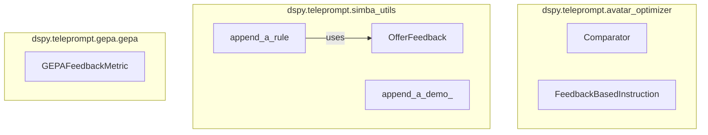

# feedback_and_rules
This module provides DSPy signatures for generating and incorporating feedback, a protocol for defining feedback metrics, and utility functions for dynamically appending rules and demonstrations to improve LLM program performance.

<!-- DIAGRAM_JSON
{
  "nodes": [
    {"id": "Comparator", "label": "Comparator"},
    {"id": "FeedbackBasedInstruction", "label": "FeedbackBasedInstruction"},
    {"id": "GEPAFeedbackMetric", "label": "GEPAFeedbackMetric"},
    {"id": "append_a_rule", "label": "append_a_rule"},
    {"id": "append_a_demo_", "label": "append_a_demo_"},
    {"id": "OfferFeedback", "label": "OfferFeedback"}
  ],
  "edges": [
    {"source": "append_a_rule", "target": "OfferFeedback", "label": "uses"}
  ],
  "groups": [
    {"id": "avatar_optimizer", "label": "dspy.teleprompt.avatar_optimizer", "nodes": ["Comparator", "FeedbackBasedInstruction"]},
    {"id": "simba_utils", "label": "dspy.teleprompt.simba_utils", "nodes": ["append_a_rule", "append_a_demo_", "OfferFeedback"]},
    {"id": "gepa", "label": "dspy.teleprompt.gepa.gepa", "nodes": ["GEPAFeedbackMetric"]}
  ]
}
-->
