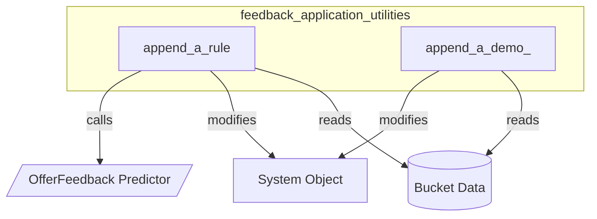

# feedback_application_utilities
This module provides utilities for applying feedback to a dspy system, either by modifying predictor instructions based on performance rules or by appending successful execution traces as demonstrations.

<!-- DIAGRAM_JSON
{
    "nodes": [
        {
            "id": "append_rule",
            "label": "append_a_rule",
            "type": "function"
        },
        {
            "id": "append_demo",
            "label": "append_a_demo_",
            "type": "function"
        },
        {
            "id": "system_obj",
            "label": "System Object",
            "type": "data"
        },
        {
            "id": "bucket_data",
            "label": "Bucket Data",
            "type": "data"
        },
        {
            "id": "offer_feedback",
            "label": "OfferFeedback Predictor",
            "type": "external"
        }
    ],
    "edges": [
        {
            "source": "append_rule",
            "target": "system_obj",
            "label": "modifies"
        },
        {
            "source": "append_rule",
            "target": "bucket_data",
            "label": "reads"
        },
        {
            "source": "append_rule",
            "target": "offer_feedback",
            "label": "calls"
        },
        {
            "source": "append_demo",
            "target": "system_obj",
            "label": "modifies"
        },
        {
            "source": "append_demo",
            "target": "bucket_data",
            "label": "reads"
        }
    ],
    "groups": [
        {
            "id": "feedback_application_utilities",
            "label": "feedback_application_utilities",
            "nodes": [
                "append_rule",
                "append_demo"
            ]
        }
    ]
}
-->
