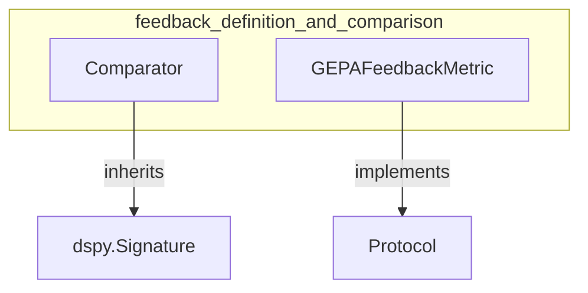

# feedback_definition_and_comparison
This module defines components for comparing execution results and generating feedback, including a signature for identifying patterns in good vs. bad outcomes and an interface for GEPA-specific feedback metrics.

<!-- DIAGRAM_JSON
{
  "nodes": [
    {"id": "Comparator", "label": "Comparator", "type": "class"},
    {"id": "GEPAFeedbackMetric", "label": "GEPAFeedbackMetric", "type": "protocol"},
    {"id": "dspy.Signature", "label": "dspy.Signature", "type": "class"},
    {"id": "Protocol", "label": "Protocol", "type": "class"}
  ],
  "edges": [
    {"source": "Comparator", "target": "dspy.Signature", "type": "inherits"},
    {"source": "GEPAFeedbackMetric", "target": "Protocol", "type": "inherits"}
  ],
  "groups": [
    {"id": "feedback_definition_and_comparison", "label": "feedback_definition_and_comparison", "nodes": ["Comparator", "GEPAFeedbackMetric"]}
  ]
}
-->
