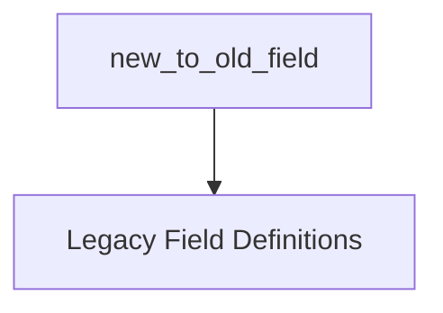

# Field Conversion Module

## Introduction

The `field_conversion` module is a crucial component within the `dspy.signatures.field` package, primarily responsible for translating modern field definitions into the legacy `OldInputField` and `OldOutputField` formats. This module ensures backward compatibility and smooth integration between different versions or styles of field declarations within DSPy's signature system.

## Core Functionality

The `field_conversion` module contains a single, focused utility function: `new_to_old_field`.

### `new_to_old_field`

```python
def new_to_old_field(field):
    return (OldInputField if field.json_schema_extra["__dspy_field_type"] == "input" else OldOutputField)(
        prefix=field.json_schema_extra["prefix"],
        desc=field.json_schema_extra["desc"],
        format=field.json_schema_extra.get("format"),
    )
```

This function takes a `field` object (which is expected to have a `json_schema_extra` attribute containing DSPy-specific metadata) and converts it into either an `OldInputField` or `OldOutputField` instance. The conversion logic is based on the `__dspy_field_type` key within `json_schema_extra`:

- If `__dspy_field_type` is `"input"`, it creates an `OldInputField`.
- Otherwise (implicitly, if it's `"output"` or any other non-input type), it creates an `OldOutputField`.

The `prefix`, `desc`, and `format` attributes for the legacy field are extracted directly from the `json_schema_extra` of the input `field`.

## Architecture and Component Relationships

The `field_conversion` module primarily interacts with the legacy field definitions to perform its core task. It acts as an adapter, bridging newer field representations with the established `OldInputField` and `OldOutputField` structures.

<!-- DIAGRAM_JSON
{
    "direction": "TD",
    "nodes": [
        {"id": "new_to_old_field", "label": "new_to_old_field", "type": "component", "link": null},
        {"id": "legacy_field_definitions", "label": "Legacy Field Definitions", "type": "external", "link": "legacy_field_definitions.md"}
    ],
    "edges": [
        {"source": "new_to_old_field", "target": "legacy_field_definitions"}
    ],
    "groups": []
}
-->


## How it Fits into the Overall System

The `field_conversion` module plays a vital role in maintaining the flexibility and evolvability of DSPy's signature system. It allows for the introduction of new, potentially more expressive ways to define fields (e.g., using Pydantic models with `json_schema_extra`) while still ensuring compatibility with existing DSPy components that expect the `OldInputField` or `OldOutputField` formats.

It is directly used by the `dspy.signatures` module, particularly when processing and normalizing field definitions across different parts of the framework. This ensures that whether fields are defined using older patterns or newer, more advanced mechanisms, they can all be consistently represented and utilized within DSPy programs.