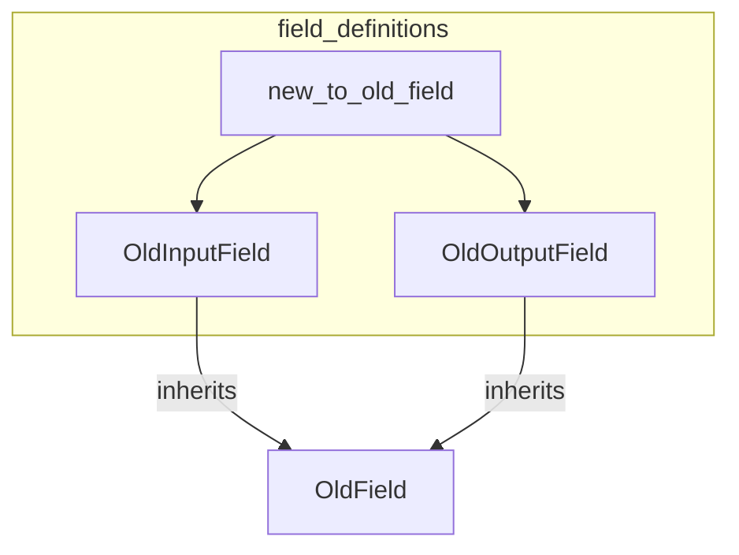

# field_definitions
The `field_definitions` module defines legacy field classes, `OldInputField` and `OldOutputField`, inheriting from `OldField`. It also provides `new_to_old_field` for converting modern field objects into these older representations.

<!-- DIAGRAM_JSON
{
  "nodes": [
    {"id": "new_to_old_field", "label": "new_to_old_field", "type": "function"},
    {"id": "OldInputField", "label": "OldInputField", "type": "class"},
    {"id": "OldOutputField", "label": "OldOutputField", "type": "class"},
    {"id": "OldField", "label": "OldField", "type": "class", "isExternal": true}
  ],
  "edges": [
    {"source": "new_to_old_field", "target": "OldInputField", "type": "uses"},
    {"source": "new_to_old_field", "target": "OldOutputField", "type": "uses"},
    {"source": "OldInputField", "target": "OldField", "type": "inherits"},
    {"source": "OldOutputField", "target": "OldField", "type": "inherits"}
  ],
  "groups": [
    {"id": "field_definitions", "label": "field_definitions", "nodes": ["new_to_old_field", "OldInputField", "OldOutputField"]}
  ]
}
-->
