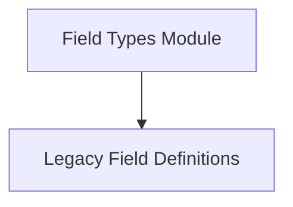

# Field Types Module

## Introduction
The `field_types` module is a crucial part of DSPy's signature system, specifically designed to define legacy input and output fields. These fields are fundamental for structuring the inputs and outputs of DSPy programs, ensuring clear and consistent data flow.

## Architecture
This module focuses on providing basic building blocks for defining fields, which are then utilized by higher-level signature components. It acts as a foundational layer, ensuring that all signature fields adhere to a consistent structure.

<!-- DIAGRAM_JSON
{
    "direction": "TD",
    "nodes": [
        {"id": "legacy_field_definitions", "label": "Legacy Field Definitions", "type": "module", "link": "legacy_field_definitions.md"}
    ],
    "edges": [],
    "groups": []
}
-->

## Sub-modules
* [Legacy Field Definitions](legacy_field_definitions.md): Contains the base classes for defining legacy input and output fields.