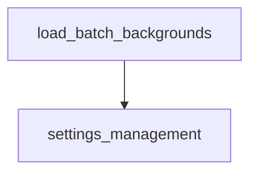

# general_utilities

## Introduction
The `general_utilities` module provides a collection of general utility functions designed to support various operations within the DSPy framework. Its primary focus is on helper functions that facilitate data loading and processing, particularly concerning background information for retrieval-augmented tasks.

## Core Functionality
The `general_utilities` module currently includes the `load_batch_backgrounds` function, which is essential for efficiently retrieving and formatting background passages for a given set of query IDs.

### `load_batch_backgrounds`
This function is responsible for retrieving relevant background passages based on a list of query identifiers (`qids`). It checks if a mapping from query IDs to background passage IDs (`qid2backgrounds`) is available. If so, it fetches the corresponding passages from a provided collection and concatenates them into a single string for each query.

**Purpose:** To prepare contextual background information for a batch of queries, often used in information retrieval or question-answering systems to augment language models.

**Usage:**
```python
def load_batch_backgrounds(args, qids):
    # ... implementation details ...
```
The `args` object is expected to contain `qid2backgrounds` (a dictionary mapping query IDs to a list of passage IDs or actual passages) and either `collection` (a list of passages indexed by PID) or `collectionX` (a dictionary mapping PIDs to passages).

## Architecture and Component Relationships

The `general_utilities` module is a leaf module under `dspy_dsp_utilities.dsp_utils`. It provides foundational utility functions that other modules within the DSPy framework can leverage. Specifically, it depends on external data structures (like `qid2backgrounds` and `collection` from the `args` object) which are likely configured or managed by other parts of the system, potentially influenced by modules like `settings_management`.

<!-- DIAGRAM_JSON
{
    "direction": "TD",
    "nodes": [
        {"id": "load_batch_backgrounds", "label": "load_batch_backgrounds", "type": "component", "link": null},
        {"id": "settings_management", "label": "settings_management", "type": "external", "link": "settings_management.md"}
    ],
    "edges": [
        {"source": "load_batch_backgrounds", "target": "settings_management"}
    ],
    "groups": []
}
-->


**Relationship with other modules:**
*   **`dspy_dsp_utilities.dsp_utils`**: `general_utilities` is a sub-module of `dsp_utils`, contributing to the broader set of utility functions within the DSPy framework.
*   **`settings_management`**: The `load_batch_backgrounds` function relies on an `args` object which contains configuration and data references (like `qid2backgrounds` and `collection`). It is anticipated that the `settings_management` module, responsible for managing DSPy's global settings, would influence or provide aspects of this `args` object.
