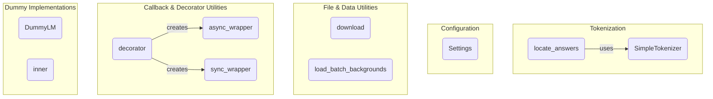

# general_utilities
This module provides a collection of general-purpose utilities, including text tokenization, configuration management, file operations, callback wrappers, and dummy implementations for testing.

<!-- DIAGRAM_JSON
{
    "nodes": [
        {
            "id": "ST",
            "label": "SimpleTokenizer",
            "type": "class"
        },
        {
            "id": "LA",
            "label": "locate_answers",
            "type": "function"
        },
        {
            "id": "S",
            "label": "Settings",
            "type": "class"
        },
        {
            "id": "LBB",
            "label": "load_batch_backgrounds",
            "type": "function"
        },
        {
            "id": "D",
            "label": "download",
            "type": "function"
        },
        {
            "id": "DEC",
            "label": "decorator",
            "type": "function"
        },
        {
            "id": "AW",
            "label": "async_wrapper",
            "type": "function"
        },
        {
            "id": "SW",
            "label": "sync_wrapper",
            "type": "function"
        },
        {
            "id": "DLM",
            "label": "DummyLM",
            "type": "class"
        },
        {
            "id": "I",
            "label": "inner",
            "type": "function"
        }
    ],
    "edges": [
        {
            "source": "LA",
            "target": "ST",
            "label": "uses"
        },
        {
            "source": "DEC",
            "target": "AW",
            "label": "creates"
        },
        {
            "source": "DEC",
            "target": "SW",
            "label": "creates"
        }
    ],
    "groups": [
        {
            "id": "G1",
            "label": "Tokenization",
            "nodes": [
                "ST",
                "LA"
            ]
        },
        {
            "id": "G2",
            "label": "Configuration",
            "nodes": [
                "S"
            ]
        },
        {
            "id": "G3",
            "label": "File & Data Utilities",
            "nodes": [
                "D",
                "LBB"
            ]
        },
        {
            "id": "G4",
            "label": "Callback & Decorator Utilities",
            "nodes": [
                "DEC",
                "AW",
                "SW"
            ]
        },
        {
            "id": "G5",
            "label": "Dummy Implementations",
            "nodes": [
                "DLM",
                "I"
            ]
        }
    ]
}
-->
