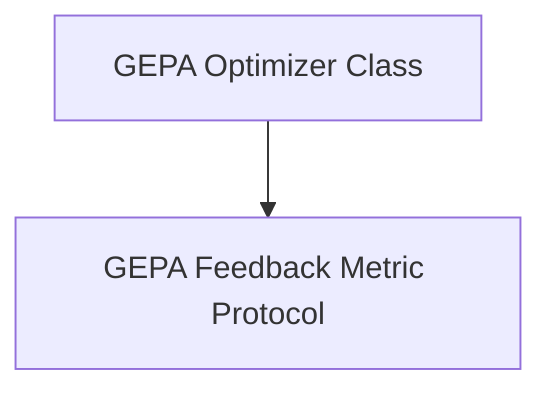

# GEPA Core Module

The `gepa_core` module provides the foundational components for the GEPA (Generative Evolutionary Prompt Optimization) teleprompter in DSPy. It encapsulates the main GEPA optimizer class and the protocol for defining feedback metrics, which are crucial for guiding the evolutionary process of prompts.

## Architecture

The GEPA Core module is composed of two primary elements: the `GEPA` optimizer class and the `GEPAFeedbackMetric` protocol. The `GEPA` class orchestrates the entire optimization process, utilizing the `GEPAFeedbackMetric` to evaluate program performance and generate feedback for reflection and evolution.

<!-- DIAGRAM_JSON
{
    "direction": "TD",
    "nodes": [
        {"id": "gepa_optimizer_class", "label": "GEPA Optimizer Class", "type": "module", "link": "gepa_optimizer_class.md"},
        {"id": "gepa_feedback_metric_protocol", "label": "GEPA Feedback Metric Protocol", "type": "module", "link": "gepa_feedback_metric_protocol.md"}
    ],
    "edges": [
        {"source": "gepa_optimizer_class", "target": "gepa_feedback_metric_protocol", "label": "utilizes"}
    ],
    "groups": []
}
-->

## Sub-modules and Functionality

### [GEPA Optimizer Class](gepa_optimizer_class.md)

This sub-module contains the `GEPA` class, which is the heart of the GEPA teleprompter. It provides an evolutionary optimization engine that leverages reflection to iteratively improve the text components (prompts) of complex systems. The `GEPA` class manages the compilation process, applies reflective updates based on a specified metric, and can be configured for various aspects like budget, reflection strategy, and logging.

### [GEPA Feedback Metric Protocol](gepa_feedback_metric_protocol.md)

The `GEPAFeedbackMetric` sub-module defines a protocol for creating custom metric functions. These functions are crucial for providing feedback to the GEPA optimizer, allowing it to evaluate the performance of predictors and the overall program execution. The protocol specifies the arguments that the metric function must accept, enabling fine-grained feedback at both the program and individual predictor levels.