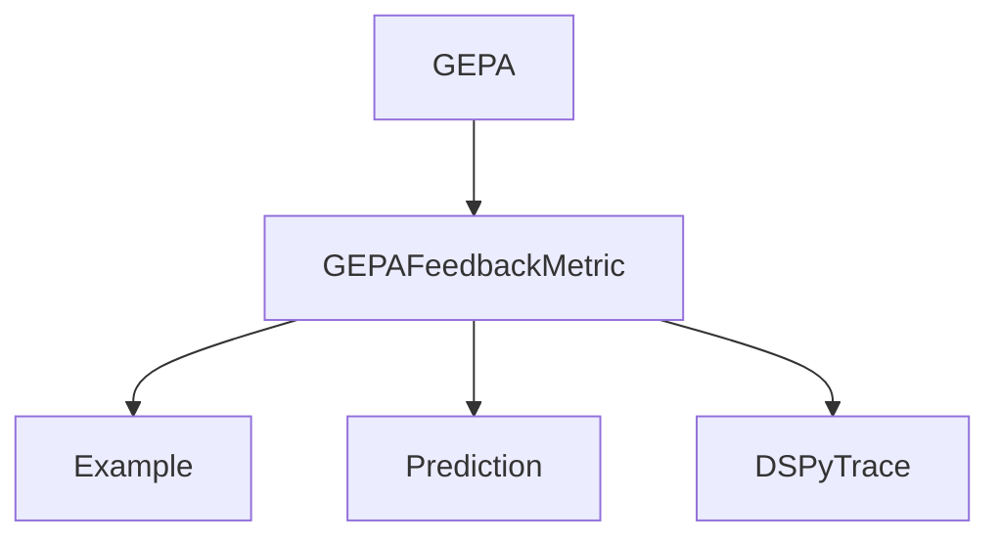

# GEPA Feedback Metric Protocol Module

The `gepa_feedback_metric_protocol` module defines the `GEPAFeedbackMetric` protocol, a crucial interface for specifying custom feedback mechanisms within the Generative Pre-trained Transformer-based Agent (GEPA) optimization framework in DSPy.

This protocol ensures that various evaluation metrics can be seamlessly integrated into the GEPA optimization process, allowing for flexible and detailed assessment of DSPy program performance and guiding the iterative refinement of prompts and program logic.

## Core Functionality

### `GEPAFeedbackMetric` Protocol

`GEPAFeedbackMetric` is a Python `Protocol` that dictates the signature for feedback functions used by the GEPA optimizer. These functions are responsible for evaluating the performance of a DSPy program's execution and optionally providing textual feedback that can be used to improve the program.

```python
class GEPAFeedbackMetric(Protocol):
    def __call__(
        self,
        gold: Example,
        pred: Prediction,
        trace: Optional["DSPyTrace"],
        pred_name: str | None,
        pred_trace: Optional["DSPyTrace"],
    ) -> Union[float, "ScoreWithFeedback"]:
        """
        This function is called with the following arguments:
        - gold: The gold example.
        - pred: The predicted output.
        - trace: Optional. The trace of the program's execution.
        - pred_name: Optional. The name of the target predictor currently being optimized by GEPA, for which
            the feedback is being requested.
        - pred_trace: Optional. The trace of the target predictor's execution GEPA is seeking feedback for.

        Note the `pred_name` and `pred_trace` arguments. During optimization, GEPA will call the metric to obtain
        feedback for individual predictors being optimized. GEPA provides the name of the predictor in `pred_name`
        and the sub-trace (of the trace) corresponding to the predictor in `pred_trace`.
        If available at the predictor level, the metric should return dspy.Prediction(score: float, feedback: str)
        corresponding to the predictor.
        If not available at the predictor level, the metric can also return a text feedback at the program level
        (using just the gold, pred and trace).
        If no feedback is returned, GEPA will use a simple text feedback consisting of just the score:
        f"This trajectory got a score of {score}."
        """
        ...
```

**Parameters**:

*   `gold` (`Example`): The ground-truth example against which the prediction is evaluated.
*   `pred` (`Prediction`): The output generated by the DSPy program.
*   `trace` (`Optional["DSPyTrace"]`): The full execution trace of the DSPy program. This provides detailed information about how the program executed.
*   `pred_name` (`str | None`): The name of the specific predictor within the DSPy program for which GEPA is currently requesting feedback. This is useful when optimizing individual components.
*   `pred_trace` (`Optional["DSPyTrace"]`): The sub-trace corresponding to the execution of the `pred_name` predictor. This allows for fine-grained feedback on individual predictor steps.

**Returns**:

*   `Union[float, "ScoreWithFeedback"]`: The metric can return either a simple float score representing the evaluation result or a `ScoreWithFeedback` object (e.g., `dspy.Prediction(score: float, feedback: str)`) that includes both a score and a textual feedback string. If only a score is returned, GEPA defaults to a generic feedback string.

## Architecture and Component Relationships

The `GEPAFeedbackMetric` protocol serves as a vital contract that allows the `GEPA` optimizer to dynamically incorporate various custom feedback mechanisms. It establishes a clear interface for how evaluation metrics should be structured and how they interact with the optimization process.

-   **`GEPAFeedbackMetric`**: Defines the required `__call__` method for feedback functions.
-   **[GEPA Optimizer](gepa_optimizer_class.md)**: The `GEPA` optimizer (`dspy.teleprompt.gepa.gepa.GEPA`) relies on implementations of this protocol to evaluate proposed program changes and generate feedback for instruction refinement. It invokes the `__call__` method of an object conforming to this protocol.
-   **[Example](dspy_primitives.md)** and **[Prediction](dspy_primitives.md)**: These are core DSPy primitive types representing input data and program outputs, respectively, which are fundamental to any evaluation metric.
-   **`DSPyTrace`**: Represents the execution trace of a DSPy program, providing context for the evaluation.

## Integration with the Overall System

This module is a foundational part of the `dspy.teleprompt.gepa` subpackage, which is dedicated to advanced optimization strategies for DSPy programs. By providing a standardized `GEPAFeedbackMetric` protocol, it enables:

1.  **Customizable Evaluation**: Developers can define their own criteria for success and failure, tailoring the optimization process to specific task requirements.
2.  **Granular Feedback**: The ability to provide feedback at both the program and individual predictor levels empowers GEPA to make more informed decisions during instruction proposal and refinement.
3.  **Extensible Optimization**: New evaluation techniques can be easily integrated into the GEPA framework by simply implementing this protocol.

It contributes significantly to the broader `dspy_teleprompting_optimizers` category by facilitating a flexible and robust mechanism for feedback-driven program improvement within the GEPA framework.

<!-- DIAGRAM_JSON
{
    "direction": "TD",
    "nodes": [
        {"id": "gepa_feedback_metric", "label": "GEPAFeedbackMetric", "type": "component", "link": null},
        {"id": "gepa_optimizer", "label": "GEPA", "type": "external", "link": "gepa_optimizer_class.md"},
        {"id": "example", "label": "Example", "type": "external", "link": "dspy_primitives.md"},
        {"id": "prediction", "label": "Prediction", "type": "external", "link": "dspy_primitives.md"},
        {"id": "dspy_trace", "label": "DSPyTrace", "type": "external", "link": null}
    ],
    "edges": [
        {"source": "gepa_optimizer", "target": "gepa_feedback_metric"},
        {"source": "gepa_feedback_metric", "target": "example"},
        {"source": "gepa_feedback_metric", "target": "prediction"},
        {"source": "gepa_feedback_metric", "target": "dspy_trace"}
    ],
    "groups": []
}
-->

