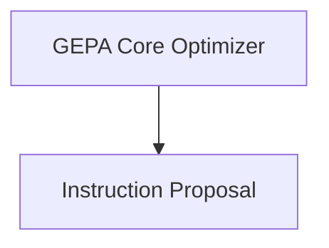

# GEPA Optimizer Module

The `gepa_optimizer` module implements the GEPA (Genetic Evolution for Prompt Adaptation) teleprompter, an evolutionary optimizer designed to refine the text components of complex systems. It focuses specifically on prompt evolution for DSPy modules, leveraging reflection to guide the optimization process and incorporating textual feedback for continuous improvement. This module allows developers to evolve predictor instructions effectively, leading to enhanced performance in various tasks.

## Architecture Overview

The `gepa_optimizer` module is logically divided into core optimization components and instruction proposal mechanisms. The `gepa_core` sub-module houses the main GEPA optimization logic, while the `instruction_proposal` sub-module is responsible for the dynamic generation and refinement of instructions, especially for multimodal inputs.

<!-- DIAGRAM_JSON
{
    "direction": "TD",
    "nodes": [
        {"id": "gepa_core", "label": "GEPA Core Optimizer", "type": "module", "link": "gepa_core.md"},
        {"id": "instruction_proposal", "label": "Instruction Proposal", "type": "module", "link": "instruction_proposal.md"}
    ],
    "edges": [
        {"source": "gepa_core", "target": "instruction_proposal"}
    ],
    "groups": []
}
-->

## Sub-modules

### GEPA Core Optimizer
This sub-module ([gepa_core.md](gepa_core.md)) contains the primary `GEPA` class, which orchestrates the entire evolutionary optimization process. It defines how execution traces are captured, how feedback is processed via the `GEPAFeedbackMetric` protocol, and how new instructions are proposed for the predictors within a DSPy program. It is the central piece of the GEPA teleprompter.

### Instruction Proposal
This sub-module ([instruction_proposal.md](instruction_proposal.md)) provides the mechanisms for generating and enhancing instructions for predictors. It includes components like `MultiModalInstructionProposer` which is designed to handle complex multimodal inputs, and `GenerateEnhancedMultimodalInstructionFromFeedback`, a signature for creating improved instructions based on detailed performance feedback and visual analysis issues.
