# grpo_optimizer Module Documentation

## Introduction
The `grpo_optimizer` module provides the Guided Reinforcement Prompt Optimization (GRPO) teleprompter, a powerful tool for fine-tuning Language Models (LMs) within DSPy programs. GRPO optimizes the student program's LMs by leveraging feedback from teacher programs and a specified metric, aiming to improve the program's overall performance.

This module is a core component of the [dspy_teleprompting_optimizers](dspy_teleprompting_optimizers.md) package, focusing on advanced prompt optimization techniques.

<!-- DIAGRAM_JSON
{
    "direction": "TD",
    "nodes": [
        {"id": "grpo", "label": "GRPO", "type": "component", "link": null},
        {"id": "finetune_teleprompter", "label": "FinetuneTeleprompter", "type": "external", "link": "dspy_teleprompting_optimizers.md"},
        {"id": "module", "label": "Module", "type": "external", "link": "dspy_primitives.md"},
        {"id": "lm", "label": "LM", "type": "external", "link": "dspy_clients.md"},
        {"id": "adapter", "label": "Adapter", "type": "external", "link": "dspy_adapters.md"},
        {"id": "evaluate", "label": "Evaluate", "type": "external", "link": "dspy_evaluation.md"},
        {"id": "bootstrap_trace_data", "label": "bootstrap_trace_data", "type": "external", "link": "bootstrap_trace.md"},
        {"id": "teleprompt_utils", "label": "Teleprompt Utils", "type": "external", "link": "teleprompt_utils.md"},
        {"id": "settings", "label": "Settings", "type": "external", "link": "dspy_dsp_utilities.md"},
        {"id": "example", "label": "Example", "type": "external", "link": "dspy_primitives.md"},
        {"id": "failed_prediction", "label": "FailedPrediction", "type": "external", "link": "dspy_primitives.md"},
        {"id": "grpogroup", "label": "GRPOGroup", "type": "component", "link": null},
        {"id": "grpogroup_status", "label": "GRPOStatus", "type": "external", "link": "dspy_clients.md"},
        {"id": "train_data_format", "label": "TrainDataFormat", "type": "external", "link": "dspy_clients.md"}
    ],
    "edges": [
        {"source": "grpo", "target": "finetune_teleprompter"},
        {"source": "grpo", "target": "module"},
        {"source": "grpo", "target": "lm"},
        {"source": "grpo", "target": "adapter"},
        {"source": "grpo", "target": "evaluate"},
        {"source": "grpo", "target": "bootstrap_trace_data"},
        {"source": "grpo", "target": "teleprompt_utils"},
        {"source": "grpo", "target": "settings"},
        {"source": "grpo", "target": "example"},
        {"source": "grpo", "target": "failed_prediction"},
        {"source": "grpo", "target": "grpogroup"},
        {"source": "grpo", "target": "grpogroup_status"},
        {"source": "grpo", "target": "train_data_format"}
    ],
    "groups": []
}
-->

```mermaid
graph TD
    grpo[GRPO]
    finetune_teleprompter[FinetuneTeleprompter]
    module[Module]
    lm[LM]
    adapter[Adapter]
    evaluate[Evaluate]
    bootstrap_trace_data[bootstrap_trace_data]
    teleprompt_utils[Teleprompt Utils]
    settings[Settings]
    example[Example]
    failed_prediction[FailedPrediction]
    grpogroup[GRPOGroup]
    grpogroup_status[GRPOStatus]
    train_data_format[TrainDataFormat]

    grpo --> finetune_teleprompter
    grpo --> module
    grpo --> lm
    grpo --> adapter
    grpo --> evaluate
    grpo --> bootstrap_trace_data
    grpo --> teleprompt_utils
    grpo --> settings
    grpo --> example
    grpo --> failed_prediction
    grpo --> grpogroup
    grpo --> grpogroup_status
    grpo --> train_data_format
```

## Core Functionality

The `grpo_optimizer` module revolves around the `GRPO` class, which implements the Guided Reinforcement Prompt Optimization algorithm. This algorithm is designed to iteratively improve the performance of a DSPy program by fine-tuning its underlying Language Models (LMs).

### `GRPO` Class

`dspy.teleprompt.grpo.GRPO`

The `GRPO` class is a specialized teleprompter that extends `FinetuneTeleprompter`. It employs a reinforcement learning-like approach to optimize the student program. This involves:

1.  **Bootstrapping Traces**: Generating execution traces of teacher programs (which can include the student program itself) on a given dataset.
2.  **Reward Assignment**: Assigning scores (rewards) to these traces based on a specified metric, including special handling for formatting failures.
3.  **Training Data Preparation**: Transforming the scored traces into a format suitable for LM fine-tuning, creating `GRPOGroup`s that represent sets of rollouts for a given predictor.
4.  **LM Fine-tuning**: Utilizing the `reinforce` method of the LMs to update their parameters based on the prepared training data, with the goal of maximizing the assigned rewards.

#### Parameters

*   `metric` (`Callable | None`): A callable function used to evaluate the performance of the DSPy program. This metric guides the optimization process by providing rewards.
*   `multitask` (`bool`): If `True`, a single training job is created for all predictors sharing the same LM. Currently, only `True` is supported.
*   `train_kwargs` (`dict[str, Any] | dict[LM, dict[str, Any]] | None`): Keyword arguments passed to the LM's `reinforce` method during fine-tuning. Can be a single dictionary or a dictionary mapping LMs to their specific training arguments.
*   `adapter` (`Adapter | dict[LM, Adapter] | None`): An adapter (e.g., `ChatAdapter`) responsible for formatting the training data for the LM. Can be a single adapter or a dictionary mapping LMs to their specific adapters.
*   `exclude_demos` (`bool`): If `True`, demos are excluded from the training data. Currently, only `True` is supported.
*   `num_threads` (`int`): The number of threads to use for parallel evaluation during bootstrapping.
*   `num_train_steps` (`int`): The total number of training steps (iterations) the GRPO algorithm will perform.
*   `seed` (`int`): A random seed for reproducibility.
*   `num_dspy_examples_per_grpo_step` (`int`): The number of DSPy examples processed in each GRPO training step.
*   `num_rollouts_per_grpo_step` (`int`): The number of rollouts (execution attempts) to generate for each DSPy example in a GRPO step.
*   `use_train_as_val` (`bool`): If `True`, the training set is also used as the validation set for reporting scores.
*   `num_steps_for_val` (`int`): The frequency (in training steps) at which validation metrics are reported.
*   `report_train_scores` (`bool`): If `True`, training scores are reported alongside validation scores.
*   `failure_score` (`float`): The score assigned to program executions that result in a general failure.
*   `format_failure_score` (`float`): The score assigned to program executions that fail due to incorrect output formatting.
*   `variably_invoked_predictor_grouping_mode` (`"truncate" | "fill" | "ragged"`): Strategy for handling predictors that are invoked a variable number of times within a rollout. Options include "truncate" (to the minimum length), "fill" (to the maximum length), or "ragged" (no padding/truncation).
*   `variably_invoked_predictor_fill_strategy` (`"randint" | "max" | None`): When `variably_invoked_predictor_grouping_mode` is "fill", this specifies how to pad shorter invocations. "randint" fills with random choices, "max" fills with the last element.

#### Methods and Internal Logic

*   `__init__(...)`:
    The constructor initializes the GRPO teleprompter with the specified parameters and performs initial validation checks, such as ensuring `failure_score` is greater than `format_failure_score` and asserting current limitations (e.g., `exclude_demos=True`, `multitask=True`). It also sets up internal state for managing training epochs and example selection.

*   `validate_trace_data_and_log_issues(...)`:
    This internal method is responsible for validating the structure and content of the trace data collected during the bootstrapping phase. It performs assertions to ensure the trace data conforms to expected shapes and contains necessary keys, logging warnings for potential issues like empty traces or mismatches in data length.

*   `report_validation_metrics(...)`:
    Periodically evaluates the student program on either a user-provided validation set or the training set (if `use_train_as_val` is `True`). It uses the [Evaluate](dspy_evaluation.md) class to compute scores based on the `metric` and logs the results. This method provides insights into the student program's performance during the optimization process.

*   `update_shuffled_trainset(...)`:
    Manages the shuffling and padding of the training dataset at the start of each new epoch. It ensures that the training set can be evenly divided into batches of `num_dspy_examples_per_grpo_step`, repeating examples if necessary to meet the batch size requirements. This helps in consistent batch processing across training steps.

*   `select_training_sample_and_update_shuffled_trainset(...)`:
    Selects a subset of the training examples for the current GRPO step based on the shuffled training set. It also triggers an update of the shuffled training set if a new epoch begins.

*   `compile(...)`:
    The main entry point for initiating the GRPO optimization process. It orchestrates the entire training loop:
    1.  **Input Validation**: Performs comprehensive checks on the provided `student` program, `trainset`, `teacher` programs, and other parameters.
    2.  **Program Preparation**: Ensures all predictors in student and teacher programs have associated LMs. It also asserts structural equivalency between student and teacher programs.
    3.  **Cache Management**: Temporarily disables the LM cache for all programs involved in training to ensure fresh generations, and restores it upon completion using utilities from [teleprompt_utils](teleprompt_utils.md).
    4.  **Training Job Setup**: Configures reinforcement learning training jobs (`LM.reinforce`) for each unique LM in the student program, taking into account `multitask` settings and `train_kwargs`.
    5.  **Training Loop**: Iterates for `num_train_steps`, performing the following actions in each step:
        *   Selects a batch of training examples.
        *   Calls `bootstrap_trace_data` (from [bootstrap_trace](bootstrap_trace.md)) on teacher programs to collect execution traces and assign initial scores based on the `metric` and handling [FailedPrediction](dspy_primitives.md) instances.
        *   Processes the collected traces into `GRPOGroup`s, which are lists of dictionaries containing messages, completion, and reward for each rollout. This involves handling variable predictor invocations based on `variably_invoked_predictor_grouping_mode` and `variably_invoked_predictor_fill_strategy`.
        *   Submits the prepared training data to the LM's `reinforce` job using the `step` method, applying updates to the LM's model.
        *   Reports validation metrics to monitor progress.
    6.  **Termination**: After the training loop, it terminates the GRPO training jobs and restores the original LM cache states.

## Architecture and Component Relationships

The `grpo_optimizer` module, through its `GRPO` class, acts as a central orchestrator for fine-tuning DSPy programs. It interacts with several other key modules and components:

*   **[FinetuneTeleprompter](dspy_teleprompting_optimizers.md)**: `GRPO` inherits from `FinetuneTeleprompter`, establishing its role as a specialized teleprompter focused on fine-tuning LMs.
*   **[Module](dspy_primitives.md)**: Both the `student` and `teacher` programs are instances of `Module`, representing the DSPy programs to be optimized and to provide feedback, respectively.
*   **[LM](dspy_clients.md)**: Language Models are at the heart of the optimization. `GRPO` interacts directly with `LM` instances to configure and run reinforcement learning training jobs.
*   **[Adapter](dspy_adapters.md)**: Adapters, particularly `ChatAdapter`, are crucial for formatting the collected traces and predictions into a format suitable for LM training data. The `settings.adapter` (from [dspy_dsp_utilities](dspy_dsp_utilities.md)) can also be used as a fallback.
*   **[Evaluate](dspy_evaluation.md)**: Used extensively in `report_validation_metrics` to assess the performance of the student program on given datasets.
*   **[bootstrap_trace_data](bootstrap_trace.md)**: This function is critical for collecting execution traces from teacher programs, forming the basis of the reinforcement learning feedback.
*   **[teleprompt_utils](teleprompt_utils.md)**: A collection of utility functions, including `disable_lm_cache`, `recover_lm_cache`, `all_predictors_have_lms`, and `assert_structural_equivalency`, which assist in managing LM states and validating program structures.
*   **[Example](dspy_primitives.md)**: Represents individual input-output examples used in the training and validation datasets.
*   **[FailedPrediction](dspy_primitives.md)**: Instances of this class are used to identify and assign specific penalties (via `format_failure_score`) to predictions that fail due to incorrect formatting.
*   **`GRPOGroup`**: An internal data structure (a list of dictionaries) representing a group of rollouts for a specific predictor, including messages, completion, and reward.
*   **[GRPOStatus](dspy_clients.md)** and **[TrainDataFormat](dspy_clients.md)**: These are types used in the communication with the LM's `reinforce` job, providing status updates and specifying the format of the training data.

## Integration with the Overall System

The `grpo_optimizer` module fits into the broader DSPy ecosystem as a sophisticated teleprompting strategy. It provides a mechanism for automating the improvement of DSPy programs by leveraging modern LM fine-tuning techniques, specifically reinforcement learning.

Developers can use `GRPO` to:

*   **Automate Program Optimization**: Instead of manual prompt engineering or few-shot tuning, `GRPO` automatically fine-tunes the LMs within a DSPy program.
*   **Improve Robustness**: By incorporating feedback on formatting failures and general prediction failures, `GRPO` can help in making programs more robust to various inputs.
*   **Leverage Teacher Models**: It allows for the use of more capable "teacher" models to guide the learning process of a "student" model, facilitating knowledge transfer and performance enhancement.
*   **Integrate with Custom Metrics**: The flexibility to provide a custom `metric` allows `GRPO` to be applied to a wide range of tasks and evaluation criteria.

`GRPO` is particularly valuable in scenarios where a DSPy program needs to achieve high performance and reliability on a specific task, often by starting with a reasonable baseline and then iteratively refining the underlying LMs through guided optimization.
