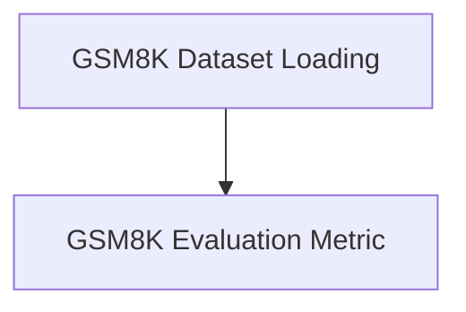

# `gsm8k_dataset` Module Documentation

## Introduction
The `gsm8k_dataset` module provides functionalities for loading, processing, and evaluating models on the GSM8K (Grade School Math 8K) dataset. This dataset is commonly used for benchmarking mathematical reasoning capabilities of language models.

## Architecture Overview
The `gsm8k_dataset` module is structured into two main sub-modules: `dataset_loading` for managing the dataset acquisition and preparation, and `evaluation_metric` for assessing model performance against the ground truth.

<!-- DIAGRAM_JSON
{
    "direction": "TD",
    "nodes": [
        {"id": "dataset_loading", "label": "GSM8K Dataset Loading", "type": "module", "link": "dataset_loading.md"},
        {"id": "evaluation_metric", "label": "GSM8K Evaluation Metric", "type": "module", "link": "evaluation_metric.md"}
    ],
    "edges": [
        {"source": "dataset_loading", "target": "evaluation_metric", "label": "provides data for"}
    ],
    "groups": []
}
-->

### Sub-modules:

*   **[GSM8K Dataset Loading](dataset_loading.md)**
    This sub-module is responsible for the entire process of loading the GSM8K dataset from its source, performing necessary preprocessing steps like parsing questions and answers, and preparing it into a structured format suitable for use with DSPy. It handles shuffling and splitting the dataset into training, development, and testing sets.

*   **[GSM8K Evaluation Metric](evaluation_metric.md)**
    This sub-module defines the specific evaluation metric used to assess the performance of models on the GSM8K dataset. It focuses on parsing integer answers from both gold and predicted outputs and comparing them to determine correctness, providing a clear measure of accuracy for mathematical reasoning tasks.
