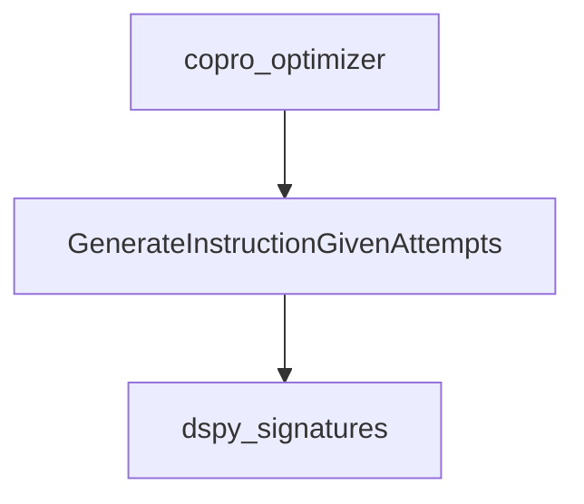

# improved_instruction_generation Module Documentation

## Introduction

The `improved_instruction_generation` module provides a specialized `dspy.Signature` for optimizing instructions given previous attempts and their validation scores. This module is a crucial component within the COPRO optimizer's instruction generation strategy, enabling the system to iteratively refine instructions to improve the performance of large language models.

## Architecture and Core Components

This module contains the `GenerateInstructionGivenAttempts` signature, which is designed to propose better instructions based on a ranked list of past attempts.

<!-- DIAGRAM_JSON
{
    "direction": "TD",
    "nodes": [
        {"id": "generate_instruction_given_attempts", "label": "GenerateInstructionGivenAttempts", "type": "component", "link": null},
        {"id": "dspy_signatures", "label": "dspy_signatures", "type": "external", "link": "dspy_signatures.md"},
        {"id": "copro_optimizer", "label": "copro_optimizer", "type": "external", "link": "copro_optimizer.md"}
    ],
    "edges": [
        {"source": "generate_instruction_given_attempts", "target": "dspy_signatures"},
        {"source": "copro_optimizer", "target": "generate_instruction_given_attempts"}
    ],
    "groups": []
}
-->

### Component: `GenerateInstructionGivenAttempts`

- **Purpose**: This `dspy.Signature` is used to generate a new, improved instruction for a language model based on a history of previously attempted instructions and their corresponding validation scores. The module leverages the fact that instructions are ordered by score (higher is better) to guide the optimization process.

- **Details**:
    - **`attempted_instructions`**: An input field that receives a collection of prior instructions along with their performance metrics.
    - **`proposed_instruction`**: An output field containing the newly generated, optimized instruction.
    - **`proposed_prefix_for_output_field`**: An output field providing a string that can serve as a prefix to help the language model initiate its response for the task.

- **Relationship to `dspy_signatures`**: `GenerateInstructionGivenAttempts` inherits from `dspy.Signature`, utilizing its framework for defining input and output fields for language model interactions.

## How it Fits into the Overall System

The `improved_instruction_generation` module, specifically the `GenerateInstructionGivenAttempts` signature, is a core component of the instruction generation capabilities within the [copro_optimizer](copro_optimizer.md) strategy. It plays a vital role in the iterative process of refining and enhancing prompt instructions for language models. By intelligently proposing new instructions based on past performance, it helps in achieving better task execution and overall model efficacy within the broader DSPy framework. This module is nested under the `instruction_proposals` submodule, which in turn is part of the `instruction_generation` module within the `copro_optimizer`.