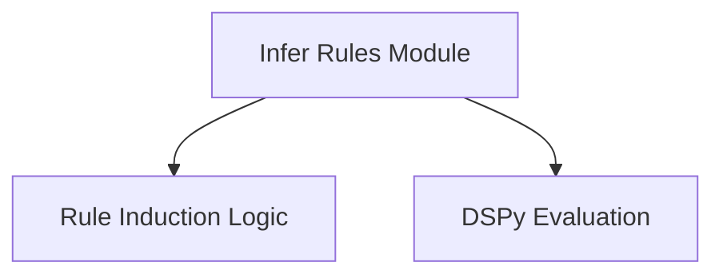

# Infer Rules Module Documentation

## Introduction
The `infer_rules` module is a crucial component within the DSPy teleprompting strategies, designed to automatically induce and apply natural language rules to enhance the performance of DSPy programs. By analyzing few-shot examples, this module identifies patterns and distills them into actionable rules, which are then integrated into the program's instruction set. This process aims to guide the language model more effectively, leading to improved task execution and output quality.

## Architecture Overview
The `infer_rules` module primarily revolves around the `InferRules` teleprompter. It extends the `BootstrapFewShot` mechanism, iteratively refining program instructions. The core process involves:
1.  **Candidate Program Generation**: Creating multiple candidate programs from an original student program.
2.  **Rule Induction**: For each predictor within a candidate program, natural language rules are induced from a given training dataset. This step leverages the `CustomRulesInduction` component.
3.  **Instruction Update**: The induced rules are appended to the predictor's signature instructions, providing enhanced guidance to the language model.
4.  **Program Evaluation**: Each candidate program is evaluated using a specified metric on a validation set, relying on the `dspy_evaluation` module.
5.  **Best Program Selection**: The candidate program that achieves the highest score is selected as the optimized program.

<!-- DIAGRAM_JSON
{
    "direction": "TD",
    "nodes": [
        {"id": "infer_rules", "label": "Infer Rules Module", "type": "module", "link": "infer_rules.md"},
        {"id": "rule_induction_logic", "label": "Rule Induction Logic", "type": "module", "link": "rule_induction_logic.md"},
        {"id": "dspy_evaluation", "label": "DSPy Evaluation", "type": "external", "link": "dspy_evaluation.md"}
    ],
    "edges": [
        {"source": "infer_rules", "target": "rule_induction_logic"},
        {"source": "infer_rules", "target": "dspy_evaluation"}
    ],
    "groups": []
}
-->

## Sub-modules

### Rule Induction Logic
The `rule_induction_logic` sub-module encapsulates the core components responsible for inducing natural language rules and applying them to improve DSPy program instructions. It contains the `InferRules` class, which orchestrates the rule induction process, and the `CustomRulesInduction` signature, which defines how rules are extracted from examples. For more details, refer to the [Rule Induction Logic documentation](rule_induction_logic.md).
