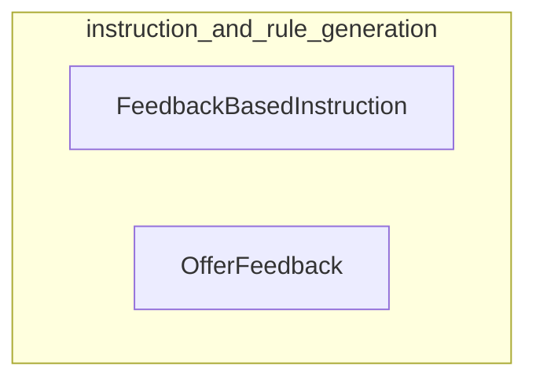

# instruction_and_rule_generation
This module defines DSPy signatures for generating improved instructions based on performance feedback and for offering detailed feedback to individual LLM program modules to enhance future performance. It provides structured interfaces for refining LLM behavior through iterative guidance.
<!-- DIAGRAM_JSON
{
  "nodes": [
    {
      "id": "FeedbackBasedInstruction",
      "label": "FeedbackBasedInstruction",
      "type": "component"
    },
    {
      "id": "OfferFeedback",
      "label": "OfferFeedback",
      "type": "component"
    }
  ],
  "edges": [],
  "groups": [
    {
      "id": "instruction_and_rule_generation",
      "label": "instruction_and_rule_generation",
      "nodes": ["FeedbackBasedInstruction", "OfferFeedback"]
    }
  ]
}
-->
