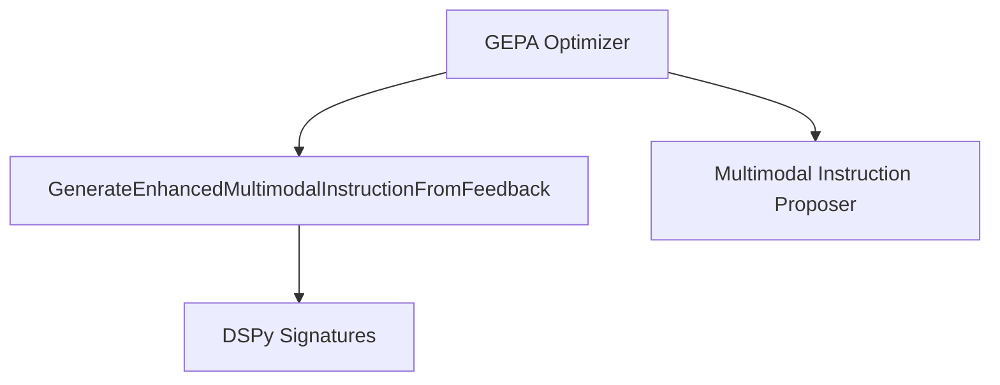

# `instruction_enhancement_signature`

The `instruction_enhancement_signature` module is a specialized component within the GEPA (Generate, Evaluate, Propose, Adapt) optimizer framework, specifically designed for refining instructions for multimodal tasks. Its core purpose is to enhance an assistant's ability to analyze visual content, integrate it with textual information, and avoid common errors based on provided feedback.

## Core Functionality

The module exposes a single, yet powerful, component:

### `GenerateEnhancedMultimodalInstructionFromFeedback`

This is a [DSPy Signature](dspy_signatures.md) that acts as a blueprint for a language model to generate improved instructions. It takes an existing instruction and a set of examples with feedback (especially concerning visual analysis and visual-textual integration) and produces a more effective instruction.

**Purpose:** To systematically improve prompt instructions for AI assistants performing multimodal tasks by incorporating specific feedback, thereby addressing issues related to visual content analysis and its integration with textual information.

**Inputs:**

*   `current_instruction` (`dspy.InputField`): The instruction currently provided to the assistant.
*   `examples_with_feedback` (`dspy.InputField`): A collection of task examples, including visual content, assistant outputs, and detailed feedback. Emphasis is placed on feedback concerning visual analysis accuracy, visual-textual integration, and missing domain-specific visual knowledge.

**Output:**

*   `improved_instruction` (`dspy.OutputField`): A refined instruction that offers clearer guidance on visual content processing, integration strategies, necessary visual domain knowledge, and proactive measures to prevent errors identified in the feedback.

**Analysis Steps (internal to the Signature's guidance):**

1.  **Read Inputs:** Carefully analyze both visual and textual input formats and their interplay.
2.  **Review Feedback:** Understand issues in visual analysis, text processing, or their integration based on assistant responses and feedback.
3.  **Identify Visual Patterns:** Recognize important visual features, relationships, or details pertinent to the task.
4.  **Extract Domain Knowledge:** Pinpoint domain-specific knowledge (visual and textual) crucial for the task.
5.  **Spot Integration Strategies:** Identify successful visual-textual integration methods.
6.  **Address Visual Issues:** Directly tackle specific visual analysis problems mentioned in the feedback.

**Instruction Requirements (for the generated output):**

*   Clear task definition for both visual and textual inputs.
*   Specific visual analysis guidance (what to look for, how to describe).
*   Strategies for integrating visual and textual observations.
*   Incorporation of domain-specific visual concepts and terminology.
*   Guidance for preventing common visual analysis mistakes.
*   Precise and actionable language for multimodal processing.

## Architecture and Component Relationships

This module is a leaf component within the `dspy.teleprompt.gepa.instruction_proposal` submodule. It provides a specialized signature that is utilized by the broader [GEPA Optimizer](gepa_optimizer.md) framework for iterative instruction refinement.

<!-- DIAGRAM_JSON
{
    "direction": "TD",
    "nodes": [
        {"id": "generate_enhanced_instruction_sig", "label": "GenerateEnhancedMultimodalInstructionFromFeedback", "type": "component", "link": null},
        {"id": "dspy_signatures", "label": "DSPy Signatures", "type": "external", "link": "dspy_signatures.md"},
        {"id": "gepa_optimizer", "label": "GEPA Optimizer", "type": "external", "link": "gepa_optimizer.md"},
        {"id": "multimodal_instruction_proposer", "label": "Multimodal Instruction Proposer", "type": "external", "link": "multimodal_instruction_proposer.md"}
    ],
    "edges": [
        {"source": "generate_enhanced_instruction_sig", "target": "dspy_signatures"},
        {"source": "gepa_optimizer", "target": "generate_enhanced_instruction_sig"},
        {"source": "gepa_optimizer", "target": "multimodal_instruction_proposer"}
    ],
    "groups": []
}
-->

## Integration with the Overall System

The `instruction_enhancement_signature` module plays a crucial role within the [GEPA Optimizer](gepa_optimizer.md) (Generate, Evaluate, Propose, Adapt) framework. It specifically supports the "Propose" phase by providing the mechanism to generate improved instructions based on evaluation feedback.

It works in conjunction with other components within the `instruction_proposal` sub-module, such as [Multimodal Instruction Proposer](multimodal_instruction_proposer.md), to ensure robust and adaptive instruction generation for complex multimodal tasks. By focusing on detailed visual analysis and integration, this module contributes to the overall effectiveness and adaptability of DSPy programs in handling diverse data types.