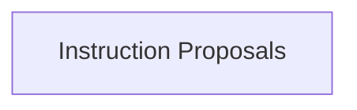

# Instruction Generation Module

The `instruction_generation` module, part of the `dspy.teleprompt.copro_optimizer` package, is responsible for defining the core signatures used to generate and optimize instructions for large language models within the DSPy framework. It provides foundational structures for proposing initial instructions and refining them based on past attempts and their validation scores.

## Architecture

The module primarily consists of the `instruction_proposals` sub-module, which encapsulates the logic for instruction creation and refinement.

<!-- DIAGRAM_JSON
{
    "direction": "TD",
    "nodes": [
        {"id": "instruction_proposals", "label": "Instruction Proposals", "type": "module", "link": "instruction_proposals.md"}
    ],
    "edges": [],
    "groups": []
}
-->

## Sub-modules

### [Instruction Proposals](instruction_proposals.md)
This sub-module defines the `BasicGenerateInstruction` and `GenerateInstructionGivenAttempts` signatures, which are crucial for the initial generation and iterative improvement of instructions for language models. It provides the structured prompts used by optimizers to guide the language model in proposing effective instructions.
