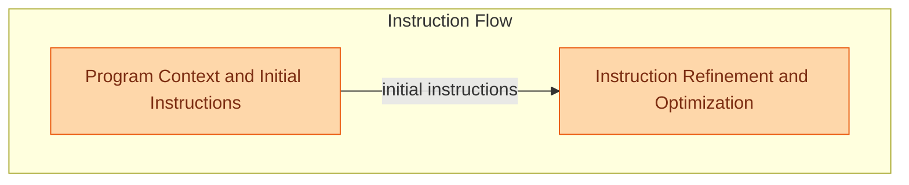

# Instruction Generation
This module is responsible for both generating initial instructions for language models based on program context and module descriptions, and for refining and optimizing these instructions through iterative feedback and rule induction.

<!-- DIAGRAM_JSON
{
    "direction": "TD",
    "nodes": [
        {
            "id": "instruction_generation",
            "label": "Instruction Generation",
            "type": "module"
        },
        {
            "id": "initial_instructions_gen",
            "label": "Program Context and Initial Instructions",
            "type": "module",
            "link": "program_context_and_initial_instructions.md"
        },
        {
            "id": "instruction_optimization",
            "label": "Instruction Refinement and Optimization",
            "type": "module",
            "link": "instruction_refinement_and_optimization.md"
        },
        {
            "id": "program_context_and_initial_instructions",
            "label": "Program Context and Initial Instructions",
            "type": "module",
            "link": "program_context_and_initial_instructions.md"
        },
        {
            "id": "instruction_refinement_and_optimization",
            "label": "Instruction Refinement and Optimization",
            "type": "module",
            "link": "instruction_refinement_and_optimization.md"
        }
    ],
    "edges": [
        {
            "source": "initial_instructions_gen",
            "target": "instruction_optimization",
            "label": "initial instructions"
        },
        {
            "source": "instruction_generation",
            "target": "program_context_and_initial_instructions"
        },
        {
            "source": "instruction_generation",
            "target": "instruction_refinement_and_optimization"
        }
    ],
    "groups": [
        {
            "id": "instruction_flow_group",
            "label": "Instruction Flow",
            "role": "generative",
            "nodes": [
                "initial_instructions_gen",
                "instruction_optimization"
            ]
        }
    ]
}
-->

