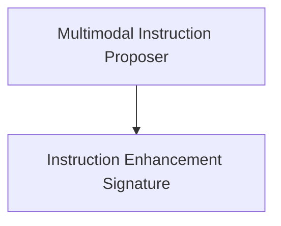

# Instruction Proposal Module

The `instruction_proposal` module, part of the `dspy.teleprompt.gepa` package, is responsible for generating and enhancing instructions, particularly in multimodal contexts. It provides mechanisms for proposing new instructions and refining existing ones based on feedback, focusing on integrating visual and textual information effectively.

## Architecture Overview

The `instruction_proposal` module consists of two main components that work in tandem to facilitate multimodal instruction optimization within the GEPA framework. The `MultiModalInstructionProposer` orchestrates the proposal process, leveraging a specialized signature, `GenerateEnhancedMultimodalInstructionFromFeedback`, to refine instructions based on detailed feedback.

<!-- DIAGRAM_JSON
{
    "direction": "TD",
    "nodes": [
        {"id": "multimodal_instruction_proposer", "label": "Multimodal Instruction Proposer", "type": "module", "link": "multimodal_instruction_proposer.md"},
        {"id": "instruction_enhancement_signature", "label": "Instruction Enhancement Signature", "type": "module", "link": "instruction_enhancement_signature.md"}
    ],
    "edges": [
        {"source": "multimodal_instruction_proposer", "target": "instruction_enhancement_signature"}
    ],
    "groups": []
}
-->

## Sub-modules

### [Multimodal Instruction Proposer](multimodal_instruction_proposer.md)
This sub-module, implemented by the `MultiModalInstructionProposer` class, is designed to handle multimodal instruction proposals within the GEPA optimization framework. It iterates through components that require updates and utilizes a single-component proposer to generate new instructions, considering both the current instruction and reflective datasets.

### [Instruction Enhancement Signature](instruction_enhancement_signature.md)
This sub-module defines the `GenerateEnhancedMultimodalInstructionFromFeedback` DSPy Signature. It provides a structured approach for generating improved instructions for multimodal tasks, with a strong emphasis on addressing visual analysis issues, integrating visual and textual information, and incorporating domain-specific visual knowledge based on provided examples and feedback.
