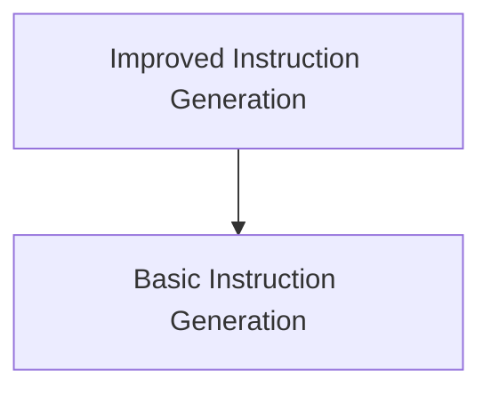

# Instruction Proposals Module

The `instruction_proposals` module, located within `dspy.teleprompt.copro_optimizer.instruction_generation`, is responsible for defining the core signatures used in generating and optimizing instructions for large language models. It provides foundational structures for both initial instruction formulation and iterative refinement based on performance feedback.

## Architecture Overview

This module contains two primary components, each defining a specific signature for instruction management:

<!-- DIAGRAM_JSON
{
    "direction": "TD",
    "nodes": [
        {"id": "basic_instruction_generation", "label": "Basic Instruction Generation", "type": "module", "link": "basic_instruction_generation.md"},
        {"id": "improved_instruction_generation", "label": "Improved Instruction Generation", "type": "module", "link": "improved_instruction_generation.md"}
    ],
    "edges": [
        {"source": "improved_instruction_generation", "target": "basic_instruction_generation"}
    ],
    "groups": []
}
-->

## Sub-modules

### [Basic Instruction Generation](basic_instruction_generation.md)
This sub-module defines the `BasicGenerateInstruction` signature, which is used to formulate an initial instruction for a language model based on its intended input and output fields. It serves as the starting point for instruction optimization.

### [Improved Instruction Generation](improved_instruction_generation.md)
This sub-module provides the `GenerateInstructionGivenAttempts` signature, designed for refining existing instructions. It takes into account previous attempts and their validation scores to propose a new, more effective instruction for the language model. This facilitates an iterative improvement process for prompt engineering.
