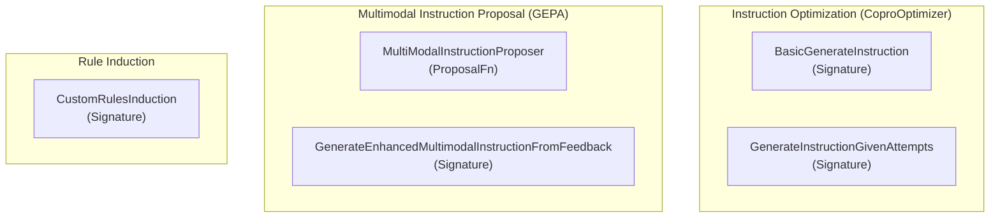

# instruction_refinement_and_optimization
This module offers components for optimizing and refining instructions given to language models, covering initial instruction generation, iterative improvement, multimodal instruction proposals, and rule induction from examples.

<!-- DIAGRAM_JSON
{
  "nodes": [
    {
      "id": "BasicGenerateInstruction",
      "label": "BasicGenerateInstruction",
      "type": "Signature"
    },
    {
      "id": "GenerateInstructionGivenAttempts",
      "label": "GenerateInstructionGivenAttempts",
      "type": "Signature"
    },
    {
      "id": "MultiModalInstructionProposer",
      "label": "MultiModalInstructionProposer",
      "type": "ProposalFn"
    },
    {
      "id": "GenerateEnhancedMultimodalInstructionFromFeedback",
      "label": "GenerateEnhancedMultimodalInstructionFromFeedback",
      "type": "Signature"
    },
    {
      "id": "CustomRulesInduction",
      "label": "CustomRulesInduction",
      "type": "Signature"
    }
  ],
  "edges": [],
  "groups": [
    {
      "id": "InstructionOptimization",
      "label": "Instruction Optimization (CoproOptimizer)",
      "nodes": [
        "BasicGenerateInstruction",
        "GenerateInstructionGivenAttempts"
      ]
    },
    {
      "id": "MultimodalInstructionProposal",
      "label": "Multimodal Instruction Proposal (GEPA)",
      "nodes": [
        "MultiModalInstructionProposer",
        "GenerateEnhancedMultimodalInstructionFromFeedback"
      ]
    },
    {
      "id": "RuleInduction",
      "label": "Rule Induction",
      "nodes": [
        "CustomRulesInduction"
      ]
    }
  ]
}
-->
