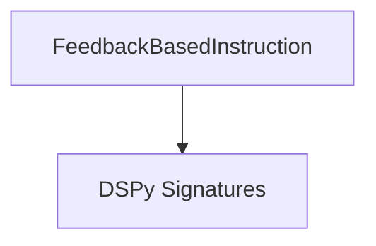

# instruction_refiner Module Documentation

The `instruction_refiner` module is a critical component within the DSPy framework's teleprompting and optimization strategies. Specifically, it provides the mechanism for iteratively refining an agent's instructions based on performance feedback. This module enables the system to adapt and improve an agent's ability to utilize tools effectively, especially in complex tasks where performance can vary across different types of inputs.

## Core Functionality

The primary functionality of the `instruction_refiner` module is encapsulated in the `FeedbackBasedInstruction` signature. This signature defines a clear interface for taking existing instructions and performance feedback, and then generating a revised, more effective instruction set for an agent or a group.

### `FeedbackBasedInstruction`

The `FeedbackBasedInstruction` is a DSPy Signature designed to address the challenge of improving an agent's performance on tasks that involve multiple tools. It operates by accepting a `previous_instruction` and `feedback` as inputs. The feedback typically highlights areas where the agent underperformed, particularly on "negative inputs," and suggests ways to improve tool usage. The signature then processes this information to produce a `new_instruction`.

The `new_instruction` is crafted to incorporate the given feedback, providing detailed guidance on how to leverage tools more effectively. It ensures that the general guidelines from the previous instruction are retained while introducing enhancements based on the performance analysis. The generated instruction is concise, limited to a maximum of three paragraphs, focusing on actionable improvements.

**Example Use Case:**
Imagine an agent tasked with customer support, using tools like a knowledge base, CRM, and internal diagnostic tools. If the agent struggles with specific types of customer queries (negative inputs), human feedback or an automated evaluation system can provide insights. The `FeedbackBasedInstruction` signature would then take the agent's current operating instructions and this feedback to generate a refined set of instructions, guiding the agent to better utilize its tools for those challenging scenarios.

## Architecture and Component Relationships

The `instruction_refiner` module is a focused component primarily centered around the `FeedbackBasedInstruction` signature.

<!-- DIAGRAM_JSON
{
    "direction": "TD",
    "nodes": [
        {"id": "feedback_based_instruction", "label": "FeedbackBasedInstruction", "type": "component", "link": null},
        {"id": "dspy_signatures", "label": "DSPy Signatures", "type": "external", "link": "dspy_signatures.md"}
    ],
    "edges": [
        {"source": "feedback_based_instruction", "target": "dspy_signatures"}
    ],
    "groups": []
}
-->

### Components

*   **`FeedbackBasedInstruction`**: This is the core and sole component within this module, responsible for the instruction refinement logic.

### Dependencies

The `instruction_refiner` module has a direct dependency on the [dspy_signatures](dspy_signatures.md) module. This dependency arises because `FeedbackBasedInstruction` is a subclass of `dspy.Signature` and utilizes `dspy.InputField` and `dspy.OutputField` for defining its input and output parameters. These core components for defining DSPy program interfaces are provided by the `dspy_signatures` module.

## Integration with the Overall System

The `instruction_refiner` module plays a vital role within the larger `dspy_teleprompting_optimizers` system, specifically nested under `avatar_optimizer.feedback_mechanism`. Its position in the module hierarchy highlights its function as a specialized mechanism for refining instructions within an adaptive optimization loop.

By generating improved instructions, this module directly contributes to the iterative enhancement of agent performance. It serves as a crucial feedback mechanism, allowing agents to learn from their successes and failures, and to continuously adapt their strategies for tool utilization. This continuous refinement is essential for building robust and intelligent DSPy programs that can effectively tackle complex, real-world tasks. The output of this module, the `new_instruction`, would typically be fed back into an agent or a teleprompter to guide subsequent executions.
