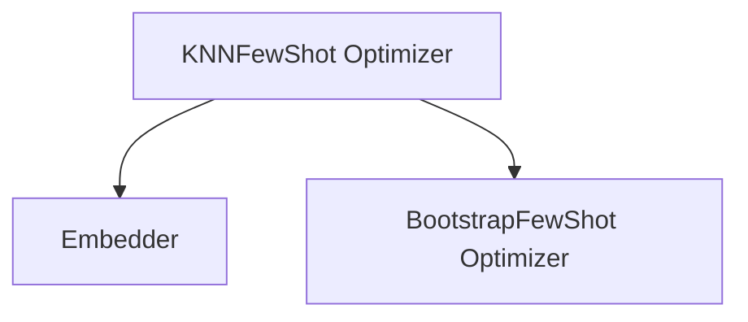

# `knn_fewshot` Module Documentation

## Introduction

The `knn_fewshot` module provides a powerful teleprompting strategy, `KNNFewShot`, designed to enhance the performance of DSPy programs by dynamically selecting relevant few-shot examples at inference time. This approach leverages K-Nearest Neighbors (KNN) to identify the most similar training examples to a given input, which are then used as demonstrations for the student module.

## Core Functionality

The `KNNFewShot` teleprompter optimizes a DSPy program by incorporating a dynamic few-shot learning mechanism. Instead of using a fixed set of demonstrations, `KNNFewShot` searches a provided `trainset` for `k` examples that are most semantically similar to the current input. These `k` examples are then passed to an underlying `BootstrapFewShot` optimizer, which compiles the student module with these dynamically selected demonstrations.

This dynamic selection process allows the student module to adapt its behavior based on the specific context of each input, leading to potentially more accurate and robust predictions, especially when the input distribution varies.

## Architecture and Component Relationships

The `knn_fewshot` module primarily revolves around the `KNNFewShot` class. It orchestrates the interaction between a KNN retriever (which uses an `Embedder` for vectorization) and the `BootstrapFewShot` teleprompter.

<!-- DIAGRAM_JSON
{
    "direction": "TD",
    "nodes": [
        {"id": "knn_fewshot_optimizer", "label": "KNNFewShot Optimizer", "type": "component", "link": null},
        {"id": "embedder", "label": "Embedder", "type": "external", "link": "dspy_retrievers.md"},
        {"id": "bootstrap_fewshot", "label": "BootstrapFewShot Optimizer", "type": "external", "link": "dspy_teleprompting_optimizers.md"}
    ],
    "edges": [
        {"source": "knn_fewshot_optimizer", "target": "embedder"},
        {"source": "knn_fewshot_optimizer", "target": "bootstrap_fewshot"}
    ],
    "groups": []
}
-->



### Component: `KNNFewShot`

```python
class KNNFewShot(Teleprompter):
    def __init__(self, k: int, trainset: list[Example], vectorizer: Embedder, **few_shot_bootstrap_args: dict[str, Any]):
        """
        KNNFewShot is an optimizer that uses an in-memory KNN retriever to find the k nearest neighbors
        in a trainset at test time. For each input example in a forward call, it identifies the k most
        similar examples from the trainset and attaches them as demonstrations to the student module.

        Args:
            k: The number of nearest neighbors to attach to the student model.
            trainset: The training set to use for few-shot prompting.
            vectorizer: The `Embedder` to use for vectorization
            **few_shot_bootstrap_args: Additional arguments for the `BootstrapFewShot` optimizer.

        Examples:
            ```python
            import dspy
            from sentence_transformers import SentenceTransformer

            # Define a QA module with chain of thought
            qa = dspy.ChainOfThought("question -> answer")

            # Create a training dataset with examples
            trainset = [
                dspy.Example(question="What is the capital of France?", answer="Paris").with_inputs("question"),
                # ... more examples ...
            ]

            # Initialize KNNFewShot with a sentence transformer model
            knn_few_shot = KNNFewShot(
                k=3,
                trainset=trainset,
                vectorizer=dspy.Embedder(SentenceTransformer("all-MiniLM-L6-v2").encode)
            )

            # Compile the QA module with few-shot learning
            compiled_qa = knn_few_shot.compile(qa)

            # Use the compiled module
            result = compiled_qa("What is the capital of Belgium?")
            ```
        """
        self.KNN = KNN(k, trainset, vectorizer=vectorizer)
        self.few_shot_bootstrap_args = few_shot_bootstrap_args

    def compile(self, student, *, teacher=None):
        student_copy = student.reset_copy()

        def forward_pass(_, **kwargs):
            knn_trainset = self.KNN(**kwargs)
            few_shot_bootstrap = BootstrapFewShot(**self.few_shot_bootstrap_args)
            compiled_program = few_shot_bootstrap.compile(
                student,
                teacher=teacher,
                trainset=knn_trainset,
            )
            return compiled_program(**kwargs)

        student_copy.forward = types.MethodType(forward_pass, student_copy)
        return student_copy
```

This class is a `Teleprompter` that, during its `compile` method, wraps the student module's `forward` method. The wrapped `forward` method first uses an internal KNN instance (initialized with the provided `k`, `trainset`, and `vectorizer`) to fetch the `k` nearest neighbors for the current input. These neighbors then form a dynamic `trainset` for a `BootstrapFewShot` instance, which is used to compile and execute the student module for that specific call.

### External Dependencies:

*   **`dspy_retrievers`**: The `Embedder` used for vectorization is typically found or related to components within the [dspy_retrievers](dspy_retrievers.md) module, which handles embedding and retrieval functionalities.
*   **`dspy_teleprompting_optimizers`**: `KNNFewShot` internally uses `BootstrapFewShot`, another powerful teleprompter, to perform the actual compilation of the student module with the selected few-shot examples. More details can be found in the [dspy_teleprompting_optimizers](dspy_teleprompting_optimizers.md) documentation.

## How it Fits into the Overall System

The `knn_fewshot` module is a specialized teleprompting strategy within the broader DSPy ecosystem. It fits into the optimization layer, providing a method to improve the performance of DSPy programs by dynamically adapting their demonstrations based on input similarity. This makes it particularly useful for applications where a diverse range of inputs might benefit from tailored few-shot examples, offering a more robust and context-aware approach to program compilation and execution. It complements other teleprompting strategies by offering a retrieval-augmented approach to demonstration selection.

## Usage Examples

For a detailed usage example, refer to the `KNNFewShot` component's docstring above, which illustrates how to initialize and compile a DSPy program with `KNNFewShot` using a `SentenceTransformer` for vectorization.
