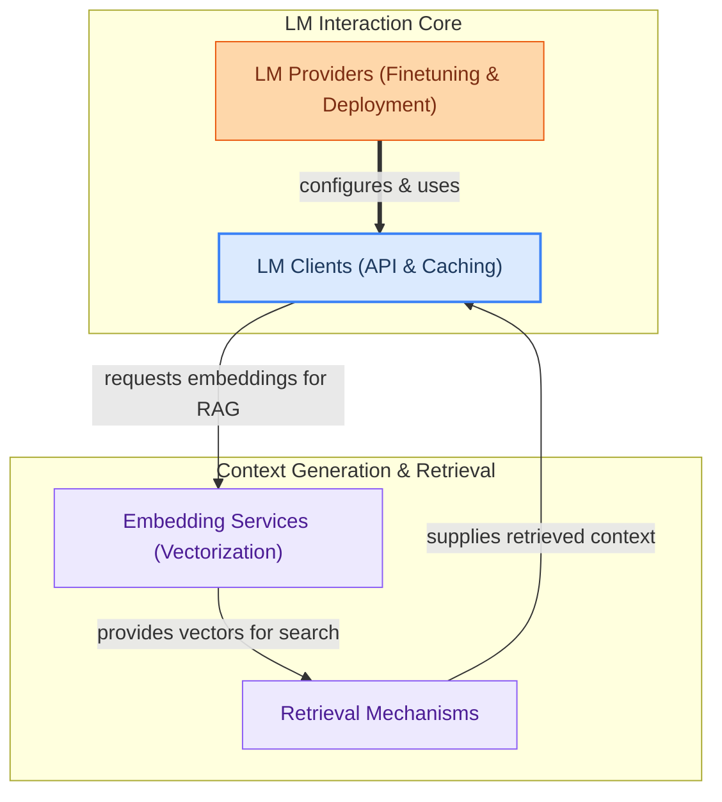

The `language_model_integration` module is the backbone for connecting DSPy programs with various Language Models (LMs) and retrieval systems. It provides a unified interface for interacting with LMs, managing caching, integrating with different LM providers (e.g., OpenAI, Databricks, local models), and facilitating efficient document retrieval through embedding services and specialized retrievers. This module ensures that DSPy programs can seamlessly leverage the power of diverse LMs and external knowledge bases.

### How it Works

The `language_model_integration` module orchestrates interactions between DSPy programs and external language models and data sources. It is structured into four key sub-modules:

1.  **LM Clients (API & Caching)**: Provides the core API for communicating with LMs, handling synchronous and asynchronous calls, streaming, and robust caching mechanisms to optimize performance and reduce API costs.
2.  **LM Providers (Finetuning & Deployment)**: Offers concrete implementations for specific LM platforms, enabling finetuning, deployment, and management of models from providers like Databricks, OpenAI, or local environments.
3.  **Embedding Services (Vectorization)**: Manages the computation and caching of text embeddings, which are crucial for efficient similarity search and retrieval.
4.  **Retrieval Mechanisms**: Integrates various retrieval-augmented generation (RAG) components, allowing DSPy programs to fetch relevant information from external knowledge bases (e.g., ColBERTv2, Weaviate, Databricks Vector Search) using embeddings.

These components work together to allow DSPy programs to:
*   **Send prompts to LMs** and receive responses, with caching for efficiency.
*   **Manage and deploy LMs** from different providers.
*   **Vectorize text** for semantic search.
*   **Retrieve relevant documents** to augment LM prompts, enhancing accuracy and groundedness.

### Core Components Documentation

*   **LM Clients**:
    *   `dspy.clients.__init__._get_dspy_cache`
    *   `dspy.clients.__init__.configure_cache`
    *   `dspy.clients.__init__.enable_litellm_logging`
    *   `dspy.clients.__init__.disable_litellm_logging`
    *   `dspy.clients.base_lm.BaseLM`
    *   `dspy.clients.cache.sync_wrapper`
    *   `dspy.clients.cache.async_wrapper`
    *   `dspy.clients.lm.litellm_responses_completion`
    *   `dspy.clients.lm.alitellm_responses_completion`
    *   `dspy.clients.lm.litellm_completion`
    *   `dspy.clients.lm.alitellm_completion`
    *   `dspy.clients.lm.sync_stream_completion`
    *   `dspy.clients.lm.async_stream_completion`
    *   `dspy.clients.lm.litellm_text_completion`
    *   `dspy.clients.lm.alitellm_text_completion`

*   **Retrievers**:
    *   `dspy.dsp.colbertv2.ColBERTv2RetrieverLocal`
    *   `dspy.dsp.colbertv2.colbertv2_get_request_v2_wrapped`
    *   `dspy.dsp.colbertv2.colbertv2_post_request_v2_wrapped`
    *   `dspy.dsp.colbertv2.ColBERTv2RerankerLocal`
    *   `dspy.dsp.colbertv2.ColBERTv2`
    *   `dspy.retrievers.databricks_rm.DatabricksRM`
    *   `dspy.retrievers.retrieve.Retrieve`
    *   `dspy.retrievers.retrieve.single_query_passage`
    *   `dspy.retrievers.weaviate_rm.WeaviateRM`

*   **LM Providers**:
    *   `dspy.clients.databricks.DatabricksProvider`
    *   `dspy.clients.databricks.TrainingJobDatabricks`
    *   `dspy.clients.lm_local.LocalProvider`
    *   `dspy.clients.lm_local.tokenize_function`
    *   `dspy.clients.openai.TrainingJobOpenAI`

*   **Embedding Services**:
    *   `dspy.clients.embedding._cached_compute_embeddings`
    *   `dspy.clients.embedding._cached_acompute_embeddings`
    *   `dspy.retrievers.embeddings.EmbeddingsWithScores`