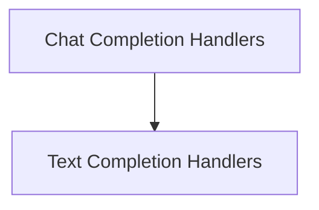

# LiteLLM API Clients

The `litellm_api_clients` module in `dspy.clients.lm` provides a unified interface for interacting with various Large Language Models (LLMs) through the LiteLLM library. This module centralizes logic for making completion requests, handling caching, retries, and streaming, ensuring consistent and robust communication with different LLM providers.

## Architecture Overview

The `litellm_api_clients` module is structured to offer both synchronous and asynchronous access to chat and text completion functionalities. It abstracts away the complexities of direct LiteLLM calls, providing specialized handlers for different types of requests and responses. The module leverages LiteLLM's capabilities for managing API keys, retries, and caching, while adding DSPy-specific identifiers to requests.

<!-- DIAGRAM_JSON
{
    "direction": "TD",
    "nodes": [
        {"id": "chat_completion_handlers", "label": "Chat Completion Handlers", "type": "module", "link": "chat_completion_handlers.md"},
        {"id": "text_completion_handlers", "label": "Text Completion Handlers", "type": "module", "link": "text_completion_handlers.md"}
    ],
    "edges": [
        {"source": "chat_completion_handlers", "target": "text_completion_handlers"}
    ],
    "groups": []
}
-->

## Module Functionality

### Chat Completion Handlers
This sub-module ([chat_completion_handlers.md](chat_completion_handlers.md)) focuses on managing chat-based completion requests. It includes functions for both standard and streaming chat completions, supporting both synchronous and asynchronous operations. It also handles specific conversions for `litellm.responses` API calls.

### Text Completion Handlers
This sub-module ([text_completion_handlers.md](text_completion_handlers.md)) provides utilities for making text completion requests. It manages the extraction of provider and model information from request strings, handles API key and base URL resolution, and constructs the appropriate prompt format for LiteLLM's text completion API.