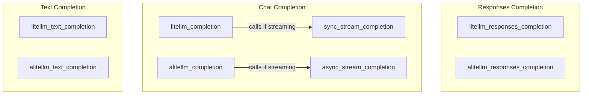

# litellm_integrations
This module provides synchronous and asynchronous wrappers for LiteLLM's `completion`, `responses`, and `text_completion` APIs, incorporating caching, retry logic, and handling for streaming responses.

<!-- DIAGRAM_JSON
{
  "nodes": [
    {"id": "litellm_responses_completion", "label": "litellm_responses_completion"},
    {"id": "alitellm_responses_completion", "label": "alitellm_responses_completion"},
    {"id": "litellm_completion", "label": "litellm_completion"},
    {"id": "alitellm_completion", "label": "alitellm_completion"},
    {"id": "sync_stream_completion", "label": "sync_stream_completion"},
    {"id": "async_stream_completion", "label": "async_stream_completion"},
    {"id": "litellm_text_completion", "label": "litellm_text_completion"},
    {"id": "alitellm_text_completion", "label": "alitellm_text_completion"}
  ],
  "edges": [
    {"source": "litellm_completion", "target": "sync_stream_completion", "label": "calls (if streaming)"},
    {"source": "alitellm_completion", "target": "async_stream_completion", "label": "calls (if streaming)"}
  ],
  "groups": [
    {"id": "Responses", "label": "Responses Completion", "nodes": ["litellm_responses_completion", "alitellm_responses_completion"]},
    {"id": "Completions", "label": "Chat Completion", "nodes": ["litellm_completion", "alitellm_completion", "sync_stream_completion", "async_stream_completion"]},
    {"id": "TextCompletions", "label": "Text Completion", "nodes": ["litellm_text_completion", "alitellm_text_completion"]}
  ]
}
-->
