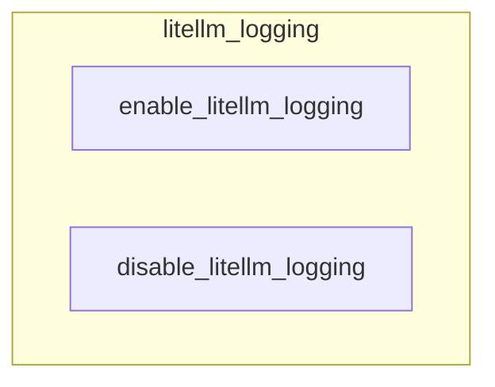

# litellm_logging
This module provides utility functions to control the logging behavior of the LiteLLM library. It allows for easy enabling or disabling of LiteLLM's debug information and adjustment of its logging level.

<!-- DIAGRAM_JSON
{
  "nodes": [
    {"id": "enable_litellm_logging", "label": "enable_litellm_logging"},
    {"id": "disable_litellm_logging", "label": "disable_litellm_logging"}
  ],
  "edges": [],
  "groups": [
    {"id": "litellm_logging", "label": "litellm_logging", "nodes": ["enable_litellm_logging", "disable_litellm_logging"]}
  ]
}
-->
