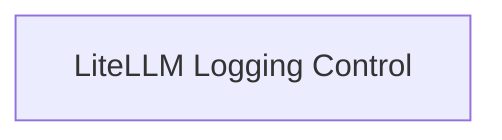

# LiteLLM Logging Module

## Introduction and Purpose

The `litellm_logging` module in DSPy clients provides utilities for managing the logging behavior of the LiteLLM library. This module allows developers to easily enable or disable verbose debugging information from LiteLLM, helping to control the output verbosity during development and production. It integrates with the `configure_litellm_logging` function (presumably from LiteLLM itself) to set appropriate logging levels.

## Architecture Overview

The `litellm_logging` module is straightforward, primarily consisting of functions to toggle LiteLLM's debugging and logging levels. It directly interacts with the LiteLLM library to modify its internal logging settings.

<!-- DIAGRAM_JSON
{
    "direction": "TD",
    "nodes": [
        {"id": "logging_control", "label": "LiteLLM Logging Control", "type": "module", "link": "logging_control.md"}
    ],
    "edges": [],
    "groups": []
}
-->

## Sub-modules

### [LiteLLM Logging Control](logging_control.md)
This sub-module provides the core functionality for enabling and disabling LiteLLM's internal debugging and logging. It includes functions to set the logging level to `DEBUG` for verbose output or `ERROR` to suppress most debugging information.

