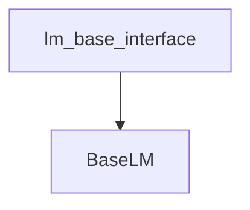

# lm_base_interface
The `lm_base_interface` module provides `BaseLM`, a foundational class for managing LLM interactions. It enables users to integrate custom language model providers by extending its core functionality.

<!-- DIAGRAM_JSON
{
  "nodes": [
    {
      "id": "lm_base_interface",
      "label": "lm_base_interface",
      "type": "module"
    },
    {
      "id": "BaseLM",
      "label": "BaseLM",
      "type": "class"
    }
  ],
  "edges": [
    {
      "source": "lm_base_interface",
      "target": "BaseLM",
      "type": "contains"
    }
  ],
  "groups": []
}
-->
