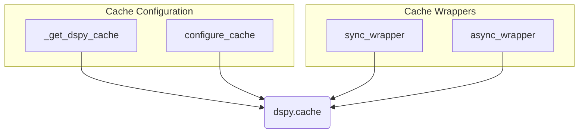

# lm_caching
The `lm_caching` module provides utilities for managing and interacting with DSPy's caching mechanism, including configuration functions and synchronous/asynchronous wrappers for caching function calls.

<!-- DIAGRAM_JSON
{
  "nodes": [
    {
      "id": "_get_dspy_cache",
      "label": "_get_dspy_cache"
    },
    {
      "id": "configure_cache",
      "label": "configure_cache"
    },
    {
      "id": "sync_wrapper",
      "label": "sync_wrapper"
    },
    {
      "id": "async_wrapper",
      "label": "async_wrapper"
    },
    {
      "id": "dspy_cache",
      "label": "dspy.cache"
    }
  ],
  "edges": [
    {
      "source": "_get_dspy_cache",
      "target": "dspy_cache",
      "label": "initializes/provides"
    },
    {
      "source": "configure_cache",
      "target": "dspy_cache",
      "label": "configures/sets"
    },
    {
      "source": "sync_wrapper",
      "target": "dspy_cache",
      "label": "uses"
    },
    {
      "source": "async_wrapper",
      "target": "dspy_cache",
      "label": "uses"
    }
  ],
  "groups": [
    {
      "id": "cache_configuration",
      "label": "Cache Configuration",
      "nodes": ["_get_dspy_cache", "configure_cache"]
    },
    {
      "id": "cache_wrappers",
      "label": "Cache Wrappers",
      "nodes": ["sync_wrapper", "async_wrapper"]
    }
  ]
}
-->
