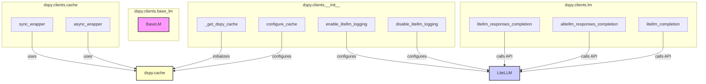

# lm_clients
The `lm_clients` module provides foundational components for interacting with Language Models in DSPy, including a base class for custom LM implementations, utilities for configuring DSPy's caching mechanism, and functions for synchronous and asynchronous LiteLLM API calls.

<!-- DIAGRAM_JSON
{
    "nodes": [
        {
            "id": "lm_clients",
            "label": "lm_clients",
            "type": "module"
        },
        {
            "id": "dspy.clients.__init__._get_dspy_cache",
            "label": "_get_dspy_cache",
            "type": "function"
        },
        {
            "id": "dspy.clients.__init__.configure_cache",
            "label": "configure_cache",
            "type": "function"
        },
        {
            "id": "dspy.clients.__init__.enable_litellm_logging",
            "label": "enable_litellm_logging",
            "type": "function"
        },
        {
            "id": "dspy.clients.__init__.disable_litellm_logging",
            "label": "disable_litellm_logging",
            "type": "function"
        },
        {
            "id": "dspy.clients.base_lm.BaseLM",
            "label": "BaseLM",
            "type": "class"
        },
        {
            "id": "dspy.clients.cache.sync_wrapper",
            "label": "sync_wrapper",
            "type": "function"
        },
        {
            "id": "dspy.clients.cache.async_wrapper",
            "label": "async_wrapper",
            "type": "function"
        },
        {
            "id": "dspy.clients.lm.litellm_responses_completion",
            "label": "litellm_responses_completion",
            "type": "function"
        },
        {
            "id": "dspy.clients.lm.alitellm_responses_completion",
            "label": "alitellm_responses_completion",
            "type": "function"
        },
        {
            "id": "dspy.clients.lm.litellm_completion",
            "label": "litellm_completion",
            "type": "function"
        },
        {
            "id": "dspy_cache",
            "label": "dspy.cache",
            "type": "data_store"
        },
        {
            "id": "litellm_lib",
            "label": "LiteLLM",
            "type": "external_library"
        },
        {
            "id": "lm_base_interface",
            "label": "Base LM Interface",
            "type": "module",
            "link": "lm_base_interface.md"
        },
        {
            "id": "litellm_logging",
            "label": "LiteLLM Logging",
            "type": "module",
            "link": "litellm_logging.md"
        },
        {
            "id": "lm_caching",
            "label": "LM Caching",
            "type": "module",
            "link": "lm_caching.md"
        },
        {
            "id": "litellm_integrations",
            "label": "LiteLLM Integrations",
            "type": "module",
            "link": "litellm_integrations.md"
        }
    ],
    "edges": [
        {
            "source": "dspy.clients.__init__._get_dspy_cache",
            "target": "dspy_cache",
            "label": "initializes"
        },
        {
            "source": "dspy.clients.__init__.configure_cache",
            "target": "dspy_cache",
            "label": "configures"
        },
        {
            "source": "dspy.clients.cache.sync_wrapper",
            "target": "dspy_cache",
            "label": "uses"
        },
        {
            "source": "dspy.clients.cache.async_wrapper",
            "target": "dspy_cache",
            "label": "uses"
        },
        {
            "source": "dspy.clients.__init__.enable_litellm_logging",
            "target": "litellm_lib",
            "label": "configures"
        },
        {
            "source": "dspy.clients.__init__.disable_litellm_logging",
            "target": "litellm_lib",
            "label": "configures"
        },
        {
            "source": "dspy.clients.lm.litellm_responses_completion",
            "target": "litellm_lib",
            "label": "calls API"
        },
        {
            "source": "dspy.clients.lm.alitellm_responses_completion",
            "target": "litellm_lib",
            "label": "calls API"
        },
        {
            "source": "dspy.clients.lm.litellm_completion",
            "target": "litellm_lib",
            "label": "calls API"
        },
        {
            "source": "lm_clients",
            "target": "lm_base_interface"
        },
        {
            "source": "lm_clients",
            "target": "litellm_logging"
        },
        {
            "source": "lm_clients",
            "target": "lm_caching"
        },
        {
            "source": "lm_clients",
            "target": "litellm_integrations"
        }
    ],
    "groups": [
        {
            "id": "__init__",
            "label": "dspy.clients.__init__",
            "nodes": [
                "dspy.clients.__init__._get_dspy_cache",
                "dspy.clients.__init__.configure_cache",
                "dspy.clients.__init__.enable_litellm_logging",
                "dspy.clients.__init__.disable_litellm_logging"
            ]
        },
        {
            "id": "base_lm",
            "label": "dspy.clients.base_lm",
            "nodes": [
                "dspy.clients.base_lm.BaseLM"
            ]
        },
        {
            "id": "cache",
            "label": "dspy.clients.cache",
            "nodes": [
                "dspy.clients.cache.sync_wrapper",
                "dspy.clients.cache.async_wrapper"
            ]
        },
        {
            "id": "lm",
            "label": "dspy.clients.lm",
            "nodes": [
                "dspy.clients.lm.litellm_responses_completion",
                "dspy.clients.lm.alitellm_responses_completion",
                "dspy.clients.lm.litellm_completion"
            ]
        }
    ]
}
-->
