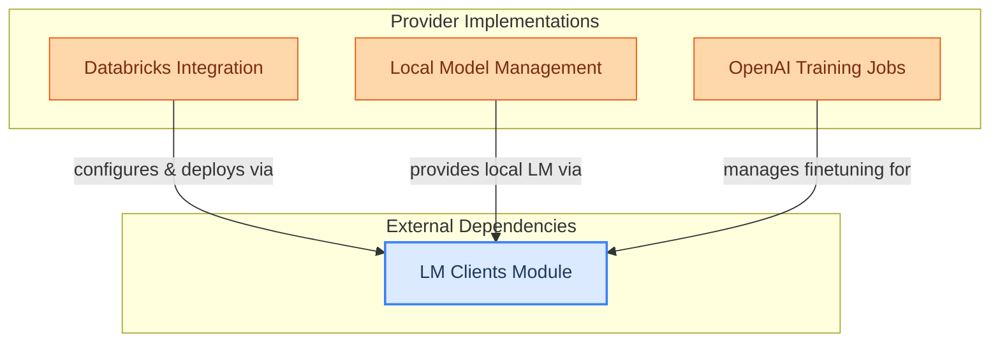

# Language Model Providers

This module provides concrete implementations for finetuning and deploying language models across different platforms like Databricks, local environments, and managing OpenAI training jobs.

<!-- DIAGRAM_JSON
{
    "direction": "TD",
    "nodes": [
        {"id": "databricks_integration", "label": "Databricks Integration", "type": "module", "link": "databricks_integration.md"},
        {"id": "local_model_management", "label": "Local Model Management", "type": "module", "link": "local_model_management.md"},
        {"id": "openai_training_jobs", "label": "OpenAI Training Jobs", "type": "module", "link": "openai_training_jobs.md"},
        {"id": "lm_clients", "label": "LM Clients Module", "type": "external", "link": "lm_clients.md"}
    ],
    "edges": [
        {"source": "databricks_integration", "target": "lm_clients", "label": "configures & deploys via"},
        {"source": "local_model_management", "target": "lm_clients", "label": "provides local LM via"},
        {"source": "openai_training_jobs", "target": "lm_clients", "label": "manages finetuning for"}
    ],
    "groups": [
        {"id": "lm_providers_impl", "label": "Provider Implementations", "role": "generative", "nodes": ["databricks_integration", "local_model_management", "openai_training_jobs"]},
        {"id": "external_dependencies", "label": "External Dependencies", "role": "surface", "nodes": ["lm_clients"]}
    ]
}
-->
