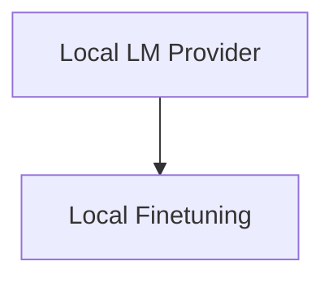

# Local Finetuning Module

## Introduction and Purpose
The `local_finetuning` module within the `dspy.clients.lm_local` package is responsible for enabling and managing local finetuning operations for language models. It provides the necessary tools to launch, manage, and finetune models directly on a local environment, primarily leveraging the SGLang server for efficient local LLM serving and training.

## Architecture Overview
The `local_finetuning` module is a child of the `local_lm_provider` module. It encapsulates the functionalities for local model management and finetuning.

<!-- DIAGRAM_JSON
{
    "direction": "TD",
    "nodes": [
        {"id": "local_lm_provider", "label": "Local LM Provider", "type": "module", "link": "local_lm_provider.md"},
        {"id": "local_finetuning", "label": "Local Finetuning", "type": "module", "link": "local_finetuning.md"}
    ],
    "edges": [
        {"source": "local_lm_provider", "target": "local_finetuning"}
    ],
    "groups": []
}
-->

## Core Functionality

### LocalProvider (`dspy.clients.lm_local.LocalProvider`)
The `LocalProvider` class is the central component for interacting with local language models. It extends the base `Provider` class and offers methods for:
-   **Launching SGLang Server**: Initiates an SGLang server to host local models, automatically finding a free port and managing the server process. It also handles capturing and providing access to server logs.
-   **Killing SGLang Server**: Gracefully terminates a running SGLang server process and cleans up associated resources.
-   **Finetuning Models Locally**: Orchestrates the finetuning process for local chat models. It supports saving training data, creating output directories, and executing the SGLang local training routine with configurable parameters. Currently, it only supports chat models for finetuning.

### tokenize_function (`dspy.clients.lm_local.tokenize_function`)
This utility function is used internally during the finetuning process to tokenize examples. It leverages an `encode_sft_example` function (not detailed here, but presumed to be part of the SGLang or a related utility) to prepare data for local finetuning, taking into account a maximum sequence length.
