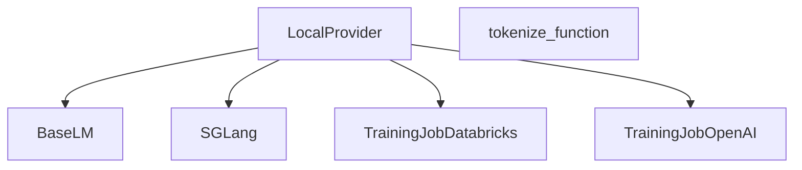

# local_lm_management Module Documentation

## Introduction

The `local_lm_management` module is responsible for managing local language models within the DSPy framework. It provides functionalities for launching, stopping, and finetuning local models, primarily leveraging the SGLang library for efficient local inference and training.

## Core Functionality

### `dspy.clients.lm_local.LocalProvider`

`LocalProvider` is a concrete implementation of a language model provider designed for local operations. It extends the `Provider` class (see [base_language_model.md]) and enables the management of finetunable local models.

**Key Methods:**

*   `launch(lm: "LM", launch_kwargs: dict[str, Any] | None = None)`:
    This static method is used to launch an SGLang server for a specified local language model. It dynamically finds a free port, constructs a command to run the `sglang.launch_server` process, and monitors its startup. Once the server is ready, it configures the `LM` instance to use the local SGLang API endpoint. It also provides a mechanism to retrieve logs from the running server.

*   `kill(lm: "LM", launch_kwargs: dict[str, Any] | None = None)`:
    This static method gracefully terminates a running SGLang server process associated with a local language model. It ensures the process and its associated threads are properly shut down.

*   `finetune(
        job: TrainingJob,
        model: str,
        train_data: list[dict[str, Any]],
        train_data_format: TrainDataFormat | None,
        train_kwargs: dict[str, Any] | None = None,
    ) -> str`:
    This static method orchestrates the local finetuning of a model using a given `TrainingJob` (see [databricks_training_job.md] and [openai_finetuning.md] for examples of TrainingJob implementations). It supports finetuning chat models, saves training data, creates an output directory, and then initiates the SFT (Supervised Fine-Tuning) process locally. It returns a string representing the path to the finetuned model.

### `dspy.clients.lm_local.tokenize_function`

This function, while not detailed in the provided code, is responsible for tokenizing input text for local language models. It likely handles the conversion of raw text into numerical tokens suitable for model processing.

## Architecture and Component Relationships

The `local_lm_management` module centers around the `LocalProvider` class, which acts as the primary interface for interacting with local language models.

*   **Inheritance**: `LocalProvider` inherits from `Provider` ([base_language_model.md]), ensuring it adheres to the general contract for language model providers within DSPy.
*   **SGLang Integration**: For launching and killing local LM servers, `LocalProvider` directly interacts with the `sglang` library. This external dependency is crucial for enabling efficient local inference.
*   **Finetuning**: The `finetune` method leverages a `TrainingJob` abstraction, allowing for a flexible approach to local model training. While the specific `TrainingJob` implementation can vary (e.g., [databricks_training_job.md], [openai_finetuning.md]), `LocalProvider` provides the local execution environment.
*   **Tokenization**: The `tokenize_function` is a utility within the module, providing tokenization capabilities that may be used by `LocalProvider` or other components requiring text processing for local models.

## How the Module Fits into the Overall System

The `local_lm_management` module is a vital part of the `dspy_clients` ecosystem, specifically designed to support the use of local language models. It allows DSPy programs to seamlessly integrate and manage models running on the local machine, offering an alternative to remote API-based LMs. This is particularly useful for development, testing, and scenarios where data privacy or reduced latency are critical. It abstracts away the complexities of setting up and managing local inference servers (via SGLang) and provides a unified interface for local finetuning.

<!-- DIAGRAM_JSON
{
    "direction": "TD",
    "nodes": [
        {"id": "local_provider", "label": "LocalProvider", "type": "component", "link": null},
        {"id": "tokenize_function", "label": "tokenize_function", "type": "component", "link": null},
        {"id": "base_lm", "label": "BaseLM", "type": "external", "link": "base_language_model.md"},
        {"id": "sglang", "label": "SGLang", "type": "external", "link": null},
        {"id": "training_job_databricks", "label": "TrainingJobDatabricks", "type": "external", "link": "databricks_training_job.md"},
        {"id": "training_job_openai", "label": "TrainingJobOpenAI", "type": "external", "link": "openai_finetuning.md"}
    ],
    "edges": [
        {"source": "local_provider", "target": "base_lm"},
        {"source": "local_provider", "target": "sglang"},
        {"source": "local_provider", "target": "training_job_databricks"},
        {"source": "local_provider", "target": "training_job_openai"}
    ],
    "groups": []
}
-->
